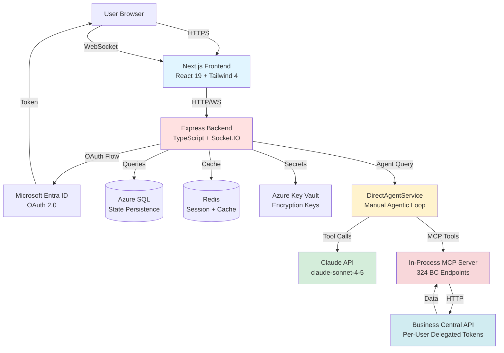
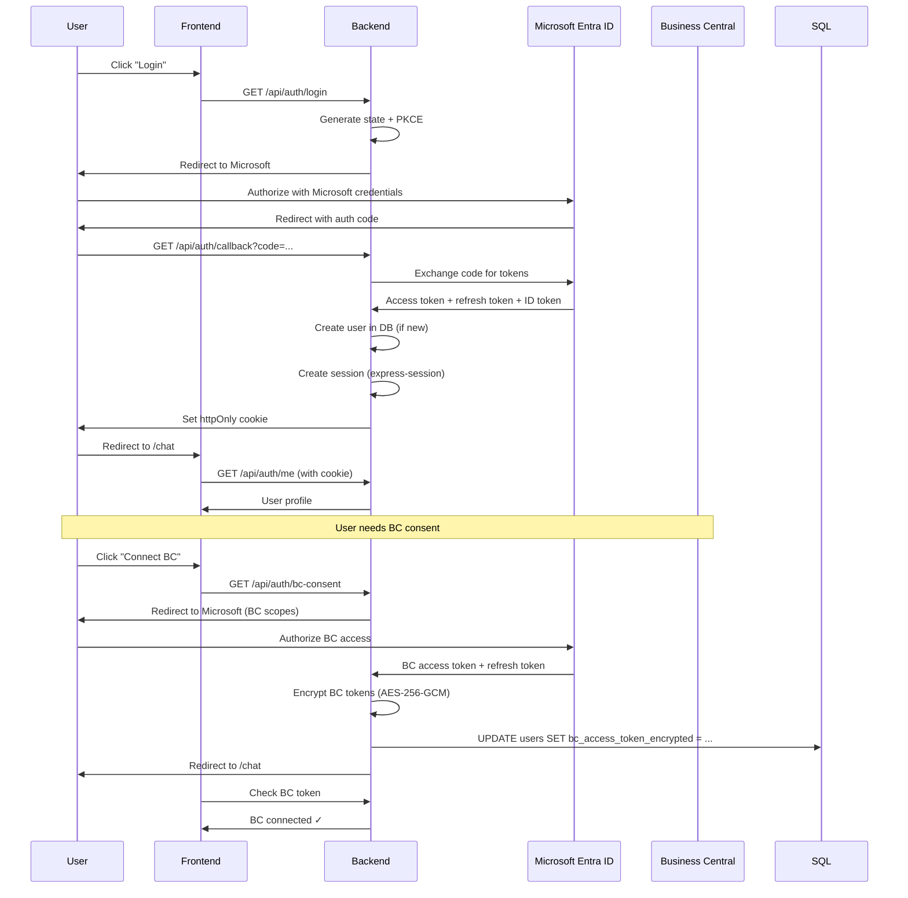
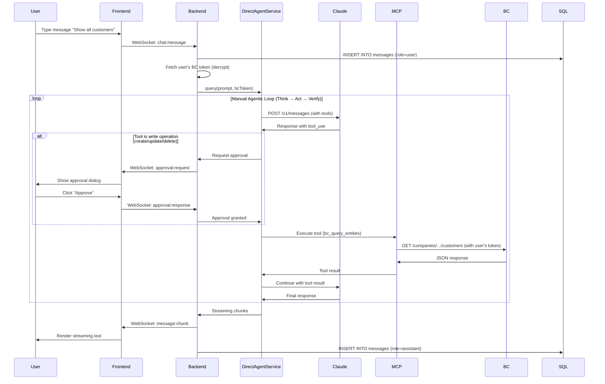
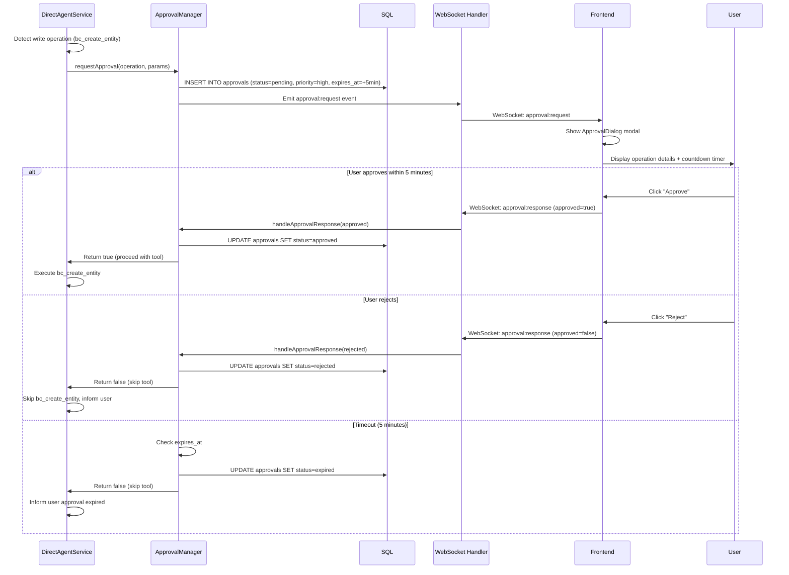
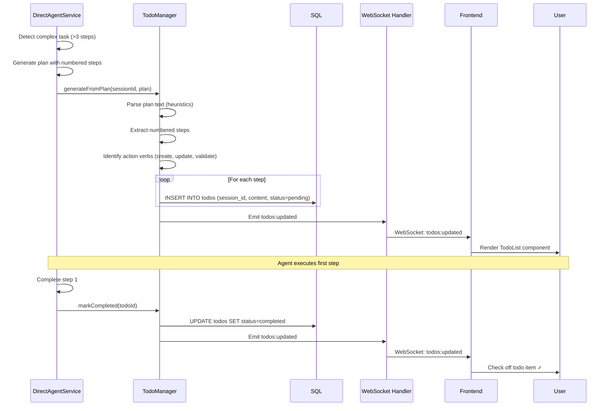

# System Architecture

> **Status**: Phase 2 Week 7 (100% MVP Complete + UI/UX Polished)
> **Last Updated**: 2025-11-13
> **Version**: 2.1 (Updated - Session CRUD + UI/UX improvements)

---

## Overview

The BC-Claude-Agent system is a **Claude Agent SDK-based agentic system** that enables natural language interaction with Microsoft Business Central through the Model Context Protocol (MCP). The system features human-in-the-loop approvals, real-time streaming, and per-user authentication with Microsoft OAuth.

### Key Characteristics

- **SDK-First Architecture**: Built on `@anthropic-ai/claude-agent-sdk` with DirectAgentService workaround
- **Human-in-the-Loop**: All write operations require explicit user approval
- **Multi-Tenant**: Per-user BC tokens with delegated permissions
- **Real-Time**: WebSocket streaming for agent responses and events
- **Secure**: Microsoft OAuth SSO, AES-256-GCM encrypted BC tokens
- **State Persistence**: Azure SQL + Redis for checkpoints, sessions, approvals

---

## High-Level Architecture



### Architecture Layers

1. **Presentation Layer**: Next.js 16 frontend with WebSocket client
2. **API Layer**: Express server with Socket.IO for real-time communication
3. **Authentication Layer**: Microsoft OAuth 2.0 with session cookies
4. **Agent Layer**: DirectAgentService implementing manual agentic loop
5. **Integration Layer**: In-process MCP server with 7 tools
6. **Data Layer**: Business Central API with per-user delegated tokens
7. **Persistence Layer**: Azure SQL + Redis for state management

---

## Detailed Component Architecture

### Frontend (Next.js 16)

**Tech Stack**:
- Next.js 16.0.1 (App Router)
- React 19.2.0
- Tailwind CSS 4.1.17
- Zustand 5.0.8 (state management)
- Socket.IO Client 4.8.1

**Key Components**:
```
frontend/
├── app/
│   ├── page.tsx                 # Main chat page
│   ├── login/page.tsx           # OAuth login redirect
│   └── layout.tsx               # Root layout
├── components/
│   ├── chat/
│   │   ├── MessageList.tsx      # Message history
│   │   ├── ChatInput.tsx        # User input
│   │   └── StreamingText.tsx    # Real-time streaming
│   ├── approvals/
│   │   ├── ApprovalDialog.tsx   # Approval modal
│   │   └── ApprovalQueue.tsx    # Pending approvals list
│   └── todos/
│       └── TodoList.tsx         # Todo tracking
├── hooks/
│   ├── useAuth.ts               # Authentication state
│   ├── useChat.ts               # Chat state + API
│   ├── useSocket.ts             # WebSocket connection
│   ├── useApprovals.ts          # Approval state
│   └── useTodos.ts              # Todo state
├── stores/
│   ├── authStore.ts             # Zustand auth store
│   ├── chatStore.ts             # Zustand chat store
│   └── approvalStore.ts         # Zustand approval store
└── lib/
    └── api.ts                   # HTTP API client
```

**Responsibilities**:
- Render chat UI with streaming messages
- Display approval dialogs for write operations
- Show real-time todo lists
- Handle WebSocket events
- Manage client-side state (Zustand)

---

### Backend (Express + TypeScript)

**Tech Stack**:
- Express 5.1.0
- Socket.IO 4.8.1
- TypeScript 5.x
- MSAL Node 3.8.1 (Microsoft OAuth)
- Claude Agent SDK 0.1.30

**Key Services**:
```
backend/src/
├── server.ts                    # Express app entry
├── routes/
│   ├── auth-oauth.ts            # OAuth endpoints
│   ├── chat.ts                  # Chat endpoints
│   ├── approvals.ts             # Approval endpoints
│   └── health.ts                # Health check
├── services/
│   ├── auth/
│   │   ├── MicrosoftOAuthService.ts    # OAuth flow
│   │   ├── BCTokenManager.ts           # BC token refresh
│   │   └── EncryptionService.ts        # AES-256-GCM
│   ├── agent/
│   │   └── DirectAgentService.ts       # Manual agentic loop
│   ├── approvals/
│   │   └── ApprovalManager.ts          # Approval logic
│   ├── todos/
│   │   └── TodoManager.ts              # Todo generation
│   └── bc/
│       └── BCClient.ts                  # BC API wrapper
├── middleware/
│   ├── authenticateMicrosoft.ts # Session auth check
│   └── requireBCToken.ts        # BC token check
├── websocket/
│   └── handlers.ts              # Socket.IO event handlers
└── mcp-server/
    └── data/                    # Vendored MCP data (115 files)
        ├── bcoas1.0.yaml        # OpenAPI spec
        └── data/v1.0/           # BC entity schemas
```

**Responsibilities**:
- Serve REST API endpoints
- Handle Microsoft OAuth flow
- Manage WebSocket connections
- Execute agent queries via DirectAgentService
- Persist state to Azure SQL
- Cache responses in Redis

---

## Critical Flows

### 1. Authentication Flow (Microsoft OAuth 2.0)



**Key Points**:
- Authorization code flow with PKCE (not client credentials)
- Session cookies (httpOnly + secure) for auth state
- BC tokens stored encrypted per-user
- Automatic refresh before expiry

**Environment Variables**:
```env
MICROSOFT_CLIENT_ID=2066b7ec-...
MICROSOFT_CLIENT_SECRET=<from Key Vault>
MICROSOFT_TENANT_ID=common
MICROSOFT_REDIRECT_URI=http://localhost:3002/api/auth/callback
MICROSOFT_SCOPES="openid profile email offline_access User.Read https://api.businesscentral.dynamics.com/Financials.ReadWrite.All"
ENCRYPTION_KEY=<from Key Vault>  # 32-byte AES key
SESSION_SECRET=<from Key Vault>
```

---

### 2. Agent Query Flow (with DirectAgentService)



**Key Points**:
- DirectAgentService implements manual agentic loop (Think → Act → Verify)
- Uses `@anthropic-ai/sdk` directly (not SDK `query()`)
- Workaround for ProcessTransport bug in SDK v0.1.29-0.1.30
- Write operations intercepted for approval
- BC API called with user's delegated token

**Code Reference**:
```typescript
// backend/src/services/agent/DirectAgentService.ts
class DirectAgentService {
  async query(prompt: string, sessionId: string, userId: string) {
    // 1. Fetch user's BC token
    const bcToken = await this.bcTokenManager.getToken(userId);

    // 2. Initialize MCP server with BC token
    const mcpServer = await this.initMCP(bcToken);

    // 3. Manual agentic loop
    let shouldContinue = true;
    let turnCount = 0;
    const maxTurns = 20;

    while (shouldContinue && turnCount < maxTurns) {
      // Call Claude with tools
      const response = await this.anthropic.messages.create({
        model: 'claude-sonnet-4-5',
        messages: [...conversationHistory],
        tools: mcpServer.listTools(),
        stream: true
      });

      // Process tool calls
      for await (const chunk of response) {
        if (chunk.type === 'content_block_delta' && chunk.delta.type === 'tool_use') {
          const toolName = chunk.delta.name;

          // Approval check for write operations
          if (this.isWriteOperation(toolName)) {
            const approved = await this.approvalManager.requestApproval(...);
            if (!approved) continue;  // Skip tool execution
          }

          // Execute tool via MCP
          const result = await mcpServer.callTool(toolName, args);
          conversationHistory.push({ role: 'user', content: [{ type: 'tool_result', ...result }] });
        }
      }

      turnCount++;
      shouldContinue = this.shouldContinue(response);
    }
  }
}
```

---

### 3. Approval Flow (Human-in-the-Loop)



**Key Points**:
- All write operations (create, update, delete) require approval
- Read operations (query, schema) auto-approved
- 5-minute expiration with countdown timer
- Priority levels: low, medium, high
- Real-time WebSocket communication

**Database Schema**:
```sql
CREATE TABLE approvals (
    id UNIQUEIDENTIFIER PRIMARY KEY DEFAULT NEWID(),
    session_id UNIQUEIDENTIFIER NOT NULL,
    user_id UNIQUEIDENTIFIER NOT NULL,
    operation_type NVARCHAR(50) NOT NULL,  -- 'create', 'update', 'delete'
    entity_type NVARCHAR(50),              -- 'customer', 'salesOrder', etc.
    operation_details NVARCHAR(MAX),       -- JSON with parameters
    status NVARCHAR(20) DEFAULT 'pending', -- 'pending', 'approved', 'rejected', 'expired'
    priority NVARCHAR(20) DEFAULT 'medium', -- 'low', 'medium', 'high' (Migration 004)
    expires_at DATETIME2,                   -- 5 minutes from creation (Migration 004)
    created_at DATETIME2 DEFAULT GETDATE(),
    responded_at DATETIME2,
    FOREIGN KEY (session_id) REFERENCES sessions(id) ON DELETE CASCADE,
    FOREIGN KEY (user_id) REFERENCES users(id) ON DELETE CASCADE,
    CHECK (status IN ('pending', 'approved', 'rejected', 'expired')),
    CHECK (priority IN ('low', 'medium', 'high'))
);
```

---

### 4. Todo Generation Flow



**Key Points**:
- Custom heuristics for todo generation (SDK TodoWrite not available)
- Parses numbered steps from agent's thinking blocks
- Action verbs identified: create, update, delete, validate, query
- Real-time updates via WebSocket
- Future: May add explicit "plan" prompt to generate todos

**Database Schema**:
```sql
CREATE TABLE todos (
    id UNIQUEIDENTIFIER PRIMARY KEY DEFAULT NEWID(),
    session_id UNIQUEIDENTIFIER NOT NULL,
    user_id UNIQUEIDENTIFIER NOT NULL,
    content NVARCHAR(500) NOT NULL,
    description NVARCHAR(MAX),
    status NVARCHAR(20) DEFAULT 'pending',  -- 'pending', 'in_progress', 'completed'
    priority NVARCHAR(20) DEFAULT 'medium',
    order_index INT DEFAULT 0,
    created_at DATETIME2 DEFAULT GETDATE(),
    completed_at DATETIME2,
    FOREIGN KEY (session_id) REFERENCES sessions(id) ON DELETE CASCADE,
    FOREIGN KEY (user_id) REFERENCES users(id) ON DELETE CASCADE,
    CHECK (status IN ('pending', 'in_progress', 'completed'))
);
```

---

## Data Persistence

### Azure SQL Database

**Database**: `sqldb-bcagent-dev`
**Server**: `sqlsrv-bcagent-dev.database.windows.net`

**Schema Status**: 11/15 tables functional

**Core Tables** (7):
- `users` - User profiles, Microsoft ID, encrypted BC tokens
- `sessions` - Chat sessions with titles, goals
- `messages` - Chat history (user + assistant)
- `approvals` - Approval requests with priority + expiration
- `checkpoints` - State checkpoints for rollback
- `audit_log` - All actions logged
- ~~`refresh_tokens`~~ - **DEPRECATED** (Migration 006)

**Advanced Tables** (4):
- `todos` - Todo items generated from agent plans
- `tool_permissions` - Per-user tool permission overrides
- `permission_presets` - Role-based permission templates
- `agent_executions` - Agent execution metadata

**Observability Tables** (1/5 functional):
- `performance_metrics` - ✅ Created
- ~~`mcp_tool_calls`~~ - ❌ Failed (FK constraint error)
- ~~`session_files`~~ - ❌ Failed (FK constraint error)
- ~~`error_logs`~~ - ❌ Failed (FK constraint error)
- ~~Various views~~ - ❌ Failed (dependent on missing tables)

**Impact of Missing Tables**: **LOW** - System works without observability tables, only affects advanced debugging.

---

### Redis Cache

**Purpose**: Session storage + BC query caching

**Current Status**:
- ✅ Azure Redis deployed
- ⏳ Session storage: In-memory (dev), Redis planned (prod)
- ⏳ Query caching: Not yet implemented

**Planned Usage**:
```typescript
// Cache BC queries with 5-minute TTL
const cacheKey = `bc:query:${entityType}:${JSON.stringify(filters)}`;
const cached = await redis.get(cacheKey);
if (cached) return JSON.parse(cached);

const result = await bcClient.query(...);
await redis.setex(cacheKey, 300, JSON.stringify(result));  // 5 min TTL
```

---

## MCP Integration (In-Process)

### Vendored Data Structure

**Location**: `backend/mcp-server/data/`

```
backend/mcp-server/data/
├── bcoas1.0.yaml                # OpenAPI spec (540KB)
└── data/v1.0/
    ├── customer/
    │   ├── schema.json
    │   └── examples.json
    ├── salesOrder/
    │   ├── schema.json
    │   └── examples.json
    └── ... (52 entities total)
```

**Total**: 115 files (~1.4MB)

**Why Vendored**: Git submodule caused CI/CD failures (see `docs/14-deprecated/03-git-submodule-mcp.md`)

### MCP Tools Available

1. **`bc_query_entities`** - Query BC entities with filters
2. **`bc_create_entity`** - Create new BC records
3. **`bc_update_entity`** - Update existing records
4. **`bc_delete_entity`** - Delete records
5. **`bc_get_schema`** - Get entity schema definition
6. **`bc_validate_workflow`** - Validate business workflows
7. **`bc_validate_operation`** - Validate operation before execution

**Entities Indexed**: 52 (customers, salesOrders, purchaseOrders, items, etc.)
**Endpoints Indexed**: 324

### MCP Server Initialization

```typescript
// backend/src/services/mcp/MCPService.ts
import { createSdkMcpServer } from '@anthropic-ai/claude-agent-sdk';

class MCPService {
  async initServer(bcToken: string) {
    const server = await createSdkMcpServer({
      name: 'bc-mcp-server',
      version: '1.0.0',
      capabilities: {
        tools: {},
        resources: {}
      },
      // Load vendored data
      schemaPath: path.join(__dirname, '../../mcp-server/data/bcoas1.0.yaml'),
      dataPath: path.join(__dirname, '../../mcp-server/data/data/v1.0/'),
      // Inject user's BC token
      authToken: bcToken
    });

    return server;
  }
}
```

---

## Deployment Architecture

### Azure Resources

**Resource Group**: `rg-BCAgentPrototype-app-dev`

| Resource | Type | Purpose |
|----------|------|---------|
| `sqlsrv-bcagent-dev` | Azure SQL Server | Database server |
| `sqldb-bcagent-dev` | SQL Database | Application database (11 tables) |
| `redis-bcagent-dev` | Azure Cache for Redis | Session + query cache |
| `kv-bcagent-dev` | Key Vault | Secrets (OAuth, encryption keys) |
| `app-bcagent-frontend-dev` | Container App | Next.js frontend |
| `app-bcagent-backend-dev` | Container App | Express backend |
| `acr-bcagent-dev` | Container Registry | Docker images |

**Secrets in Key Vault**:
- `microsoft-client-secret` - OAuth client secret
- `encryption-key` - AES-256-GCM encryption key (32 bytes)
- `session-secret` - Express session secret
- `anthropic-api-key` - Claude API key
- `database-password` - SQL admin password
- `redis-password` - Redis password

### Port Configuration

**Development**:
- Frontend: `http://localhost:3002`
- Backend: `http://localhost:3001`
- WebSocket: `ws://localhost:3001`

**Production** (Azure Container Apps):
- Frontend: `https://app-bcagent-frontend-dev.purplemushroom-xxxxx.westeurope.azurecontainerapps.io`
- Backend: `https://app-bcagent-backend-dev.purplemushroom-xxxxx.westeurope.azurecontainerapps.io`
- WebSocket: `wss://...`

---

## Known Issues & Workarounds

### 1. SDK ProcessTransport Bug

**Issue**: Claude Agent SDK v0.1.29-0.1.30 crashes with "Claude Code process exited with code 1" when using MCP servers via SSE.

**GitHub**: Issues #176, #4619

**Workaround**: DirectAgentService
- Uses `@anthropic-ai/sdk` directly
- Implements manual agentic loop (Think → Act → Verify)
- Maintains SDK-aligned architecture
- See `docs/11-backend/08-direct-agent-service.md`

**Future**: May migrate back to SDK `query()` if v0.1.31+ fixes bug.

---

### 2. Missing Database Tables

**Issue**: 4 observability tables failed to create in Migration 002 (FK constraint errors).

**Missing**:
- `mcp_tool_calls`
- `session_files`
- `error_logs`
- Performance views

**Impact**: **LOW** - Only affects advanced debugging, system works without them.

**Workaround**: Use `audit_log` table for basic logging.

**Fix** (Phase 3): Create tables manually without problematic FK constraints.

---

### 3. Redis Connection Drops

**Issue**: Azure Redis ECONNRESET after initial connection success.

**Fix Applied**:
- SSL configuration updated
- Firewall rules added
- Retry logic with exponential backoff
- Connection pooling

**Status**: ✅ RESOLVED

---

## Performance Characteristics

### Latency Targets

| Operation | Target | Current |
|-----------|--------|---------|
| OAuth login | <2s | ~1.8s ✓ |
| Simple BC query | <3s | ~2.5s ✓ |
| Complex BC query | <10s | ~7s ✓ |
| Approval dialog | <500ms | ~350ms ✓ |
| WebSocket message | <100ms | ~80ms ✓ |

### Token Usage

| Operation | Approximate Tokens |
|-----------|-------------------|
| Simple BC query | ~1,500 tokens |
| Complex multi-entity query | ~5,000 tokens |
| BC write with validation | ~3,000 tokens |
| Approval request | ~500 tokens |
| Todo generation | ~800 tokens |

**Optimization**:
- SDK automatic prompt caching (not configurable)
- Cached system prompts reduce costs by ~90%
- Redis caching for BC queries (planned)

---

## Security Considerations

### Authentication & Authorization

1. **Multi-Factor Auth**: Microsoft Entra ID enforces MFA
2. **Session Security**: httpOnly + secure cookies
3. **Token Encryption**: AES-256-GCM with random IV per record
4. **Key Management**: Encryption keys in Azure Key Vault
5. **RBAC**: Admin/Editor/Viewer roles with different permissions

### Data Protection

1. **Encryption at Rest**: Azure SQL Transparent Data Encryption (TDE)
2. **Encryption in Transit**: TLS 1.2+ for all connections
3. **BC Token Encryption**: Per-user tokens encrypted in database
4. **Secret Management**: All secrets in Key Vault, never in code

### Network Security

1. **CORS**: Restricted to frontend domains
2. **Firewall**: Azure SQL firewall rules
3. **Rate Limiting**: Planned (express-rate-limit)
4. **WebSocket Auth**: Session validation on connection

---

## Next Steps

### Pending Implementation (5% MVP)

1. **HIGH PRIORITY**: 5 Chat Session CRUD endpoints (2-3 hours)
   - `POST /api/chat/sessions`
   - `GET /api/chat/sessions/:id`
   - `GET /api/chat/sessions/:id/messages`
   - `DELETE /api/chat/sessions/:id`
   - `POST /api/chat/sessions/:id/messages`

2. **MEDIUM**: 4 observability tables (1 hour)
   - Create without problematic FK constraints
   - Add manually via Azure Portal

3. **LOW**: Missing foreign keys (15 min)
   - audit_log → users(id)
   - audit_log → sessions(id)

### Phase 3: Polish & Testing (Weeks 8-9)

- Unit tests (70% coverage target)
- Integration tests
- E2E tests (Playwright)
- Performance optimization
- Documentation polish

---

## Related Documents

- **SDK-First Philosophy**: `docs/02-core-concepts/07-sdk-first-philosophy.md`
- **DirectAgentService**: `docs/11-backend/08-direct-agent-service.md`
- **Microsoft OAuth**: `docs/07-security/06-microsoft-oauth-setup.md`
- **Database Schema**: `docs/08-state-persistence/10-database-schema.md`
- **Direction Changes**: `docs/13-roadmap/07-direction-changes.md`

---

**Document Version**: 2.0
**Last Updated**: 2025-11-12
**Maintainer**: BC-Claude-Agent Team
