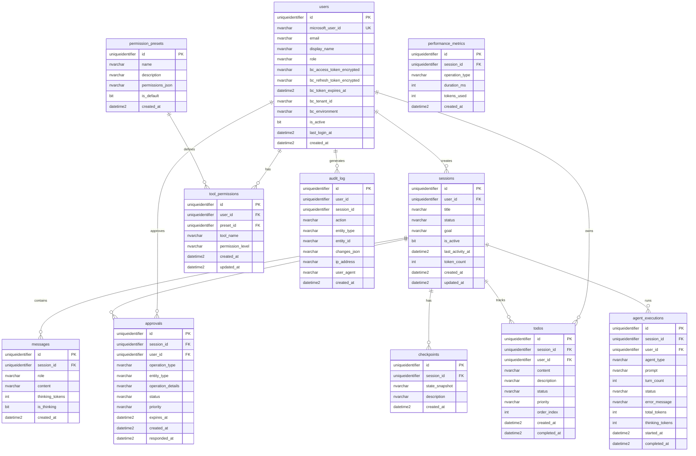

# Database Schema - Complete Reference

> **Status**: 11/15 tables functional (4 observability tables missing, non-critical)
> **Last Updated**: 2025-11-12
> **Database**: sqldb-bcagent-dev (Azure SQL)
> **Server**: sqlsrv-bcagent-dev.database.windows.net

---

## Overview

The BC-Claude-Agent system uses **Azure SQL Database** for persistent state management. The schema supports chat sessions, user authentication, approvals, todos, audit logging, and performance tracking.

### Schema Status

**Functional Tables** (11/15):
- ✅ Core (6): users, sessions, messages, approvals, checkpoints, audit_log
- ✅ Advanced (4): todos, tool_permissions, permission_presets, agent_executions
- ✅ Observability (1): performance_metrics

**Missing Tables** (4/15) - **NON-CRITICAL**:
- ❌ mcp_tool_calls (FK constraint error)
- ❌ session_files (FK constraint error)
- ❌ error_logs (FK constraint error)
- ❌ Performance views (dependent on missing tables)

**Impact**: System works without missing tables, only affects advanced debugging.

---

## Entity-Relationship Diagram



---

## Complete DDL (Data Definition Language)

### Core Tables

#### 1. users

**Purpose**: User profiles with Microsoft OAuth integration and encrypted BC tokens

```sql
CREATE TABLE users (
    id UNIQUEIDENTIFIER PRIMARY KEY DEFAULT NEWID(),
    microsoft_user_id NVARCHAR(255) UNIQUE NOT NULL,  -- From Microsoft Entra ID
    email NVARCHAR(255) UNIQUE NOT NULL,
    display_name NVARCHAR(255),
    role NVARCHAR(20) DEFAULT 'viewer',  -- 'admin', 'editor', 'viewer' (Migration 003)

    -- BC token encryption (Migration 005)
    bc_access_token_encrypted NVARCHAR(MAX),        -- AES-256-GCM encrypted
    bc_refresh_token_encrypted NVARCHAR(MAX),       -- AES-256-GCM encrypted
    bc_token_expires_at DATETIME2,                  -- Token expiry time
    bc_tenant_id NVARCHAR(255),                     -- BC tenant ID (per-user)
    bc_environment NVARCHAR(255),                   -- BC environment name

    -- User state
    is_active BIT DEFAULT 1,
    last_login_at DATETIME2,
    created_at DATETIME2 DEFAULT GETDATE(),
    updated_at DATETIME2 DEFAULT GETDATE(),

    -- Constraints
    CONSTRAINT chk_users_role CHECK (role IN ('admin', 'editor', 'viewer'))
);

-- Indexes
CREATE INDEX idx_users_microsoft_id ON users(microsoft_user_id);
CREATE INDEX idx_users_email ON users(email);
CREATE INDEX idx_users_is_active ON users(is_active);
```

**Key Changes** (Migration 005):
- ❌ Removed `password_hash` column (OAuth replaces password auth)
- ✅ Added `microsoft_user_id` (unique identifier from Microsoft)
- ✅ Added `bc_access_token_encrypted` (per-user BC token)
- ✅ Added `bc_refresh_token_encrypted` (for token refresh)
- ✅ Added `bc_token_expires_at` (auto-refresh before expiry)

---

#### 2. sessions

**Purpose**: Chat sessions with titles, goals, and activity tracking

```sql
CREATE TABLE sessions (
    id UNIQUEIDENTIFIER PRIMARY KEY DEFAULT NEWID(),
    user_id UNIQUEIDENTIFIER NOT NULL,
    title NVARCHAR(255) NOT NULL,
    status NVARCHAR(20) DEFAULT 'active',  -- 'active', 'paused', 'completed', 'error'
    goal NVARCHAR(MAX),                    -- User's goal for this session
    is_active BIT DEFAULT 1,
    last_activity_at DATETIME2 DEFAULT GETDATE(),
    token_count INT DEFAULT 0,             -- Total tokens used in session
    created_at DATETIME2 DEFAULT GETDATE(),
    updated_at DATETIME2 DEFAULT GETDATE(),

    -- Foreign Keys
    FOREIGN KEY (user_id) REFERENCES users(id) ON DELETE CASCADE,

    -- Constraints
    CONSTRAINT chk_sessions_status CHECK (status IN ('active', 'paused', 'completed', 'error'))
);

-- Indexes
CREATE INDEX idx_sessions_user_id ON sessions(user_id);
CREATE INDEX idx_sessions_is_active ON sessions(is_active);
CREATE INDEX idx_sessions_last_activity ON sessions(last_activity_at DESC);
```

**Key Features**:
- `title` auto-generated from first message or goal
- `status` tracks session state
- `is_active` for soft delete (user can archive sessions)
- `token_count` for cost tracking

**Session Persistence Strategy** (Updated 2025-11-13):

The system uses **TWO storage layers** for sessions:

#### 1. Redis Sessions (Authentication State)

**Purpose**: Store express-session data (Microsoft OAuth tokens, user ID)
**Technology**: `connect-redis@7.1.1` with `express-session`
**TTL**: 24 hours (86400 seconds)

**Storage Format**:
```redis
Key: sess:abc123def456...  (SHA256 hash of session ID)

Value (JSON):
{
  "cookie": {
    "originalMaxAge": 86400000,
    "expires": "2025-11-15T10:30:00.000Z",
    "httpOnly": true,
    "secure": false,
    "sameSite": "lax"
  },
  "microsoftOAuth": {
    "userId": "a1b2c3d4-...",
    "email": "user@example.com",
    "displayName": "John Doe",
    "accessToken": "eyJ0eXAi...",
    "refreshToken": "0.AX8A...",
    "expiresAt": "2025-11-14T11:30:00.000Z"
  }
}
```

**Why Redis**:
- ✅ Sessions survive backend restarts
- ✅ Supports horizontal scaling (multiple backend instances)
- ✅ Fast access (< 1ms)
- ✅ Automatic expiration via TTL
- ✅ Users stay logged in across deployments

**Configuration** (`backend/src/server.ts`):
```typescript
import RedisStore from 'connect-redis';
import { getRedis } from './config/redis';

app.use(session({
  store: new RedisStore({
    client: getRedis()!,
    prefix: 'sess:',
    ttl: 86400  // 24 hours
  }),
  secret: process.env.SESSION_SECRET,
  resave: false,
  saveUninitialized: false,
  cookie: {
    httpOnly: true,
    secure: process.env.NODE_ENV === 'production',
    maxAge: 24 * 60 * 60 * 1000  // 24 hours
  }
}));
```

#### 2. SQL Sessions (Chat Session Metadata)

**Purpose**: Store chat session data (title, goal, messages, approvals)
**Technology**: Azure SQL Database
**Table**: `sessions` (this table)

**Relationship**:
- **Redis sessions** ↔ **SQL sessions** are independent
- Redis stores **authentication state** (who is logged in)
- SQL stores **chat history** (what conversations happened)
- SQL `sessions.user_id` links to Redis session's `microsoftOAuth.userId`

**Example Flow**:
1. User logs in → Redis session created (contains Microsoft OAuth tokens)
2. User starts chat → SQL session created (contains title, goal)
3. User sends messages → SQL messages inserted (linked to SQL session)
4. User closes browser → Redis session persists (24h TTL)
5. User returns next day → Redis session still valid → Auto-logged in
6. Backend restarts → Redis sessions persist → Users stay logged in ✅

**Before RedisStore** (MemoryStore):
- ❌ Sessions lost on backend restart
- ❌ Users had to re-login after every deployment
- ❌ No horizontal scaling support

**After RedisStore**:
- ✅ Sessions persist across restarts
- ✅ Users stay logged in (24h TTL)
- ✅ Horizontal scaling ready

**Related Documents**:
- RedisStore Migration: `docs/04-direction-changes.md` (Direction Change #9)
- Session Architecture: `docs/01-architecture.md` (Section 6)

---

#### 3. messages

**Purpose**: Chat history (user + assistant messages)

```sql
CREATE TABLE messages (
    id UNIQUEIDENTIFIER PRIMARY KEY DEFAULT NEWID(),
    session_id UNIQUEIDENTIFIER NOT NULL,
    role NVARCHAR(20) NOT NULL,            -- 'user', 'assistant'
    content NVARCHAR(MAX) NOT NULL,
    thinking_tokens INT DEFAULT 0,         -- Tokens used in extended thinking
    is_thinking BIT DEFAULT 0,             -- Is this a thinking block?
    created_at DATETIME2 DEFAULT GETDATE(),

    -- Foreign Keys
    FOREIGN KEY (session_id) REFERENCES sessions(id) ON DELETE CASCADE,

    -- Constraints
    CONSTRAINT chk_messages_role CHECK (role IN ('user', 'assistant', 'system'))
);

-- Indexes
CREATE INDEX idx_messages_session_id ON messages(session_id);
CREATE INDEX idx_messages_created_at ON messages(created_at DESC);
```

**Key Features**:
- `role` identifies message sender
- `thinking_tokens` tracks extended thinking cost
- `is_thinking` flags thinking blocks (not shown to user)
- Cascade delete when session deleted

**Message Persistence** (Bug #5 Fix - 2025-11-14):

✅ **CONFIRMED**: Assistant messages ARE saved to database

**Implementation** (`backend/src/server.ts` lines 882-894):
```typescript
// Listen for agent:message_complete event
socket.on('agent:message_complete', async (data) => {
  // Save assistant message to database
  await db.query(`
    INSERT INTO messages (
      id,
      session_id,
      role,
      content,
      created_at
    ) VALUES (
      @id,
      @sessionId,
      'assistant',
      @content,
      GETDATE()
    )
  `, {
    id: data.id,
    sessionId: socket.sessionId,
    content: data.content
  });
});
```

**Flow**:
1. DirectAgentService completes agent query
2. Emits `agent:message_complete` event with final response
3. Backend WebSocket handler receives event
4. Inserts assistant message into `messages` table
5. Frontend displays message (already in React Query cache from streaming)

**Result**: Chat history persists across page reloads ✅

**Before Bug Fix**:
- ❌ Only user messages saved
- ❌ Chat history incomplete after reload
- ❌ Conversations lost

**After Bug Fix**:
- ✅ Both user and assistant messages saved
- ✅ Complete chat history preserved
- ✅ Conversations persist across sessions

---

#### 4. approvals

**Purpose**: Human-in-the-loop approval requests for write operations

```sql
CREATE TABLE approvals (
    id UNIQUEIDENTIFIER PRIMARY KEY DEFAULT NEWID(),
    session_id UNIQUEIDENTIFIER NOT NULL,
    user_id UNIQUEIDENTIFIER NOT NULL,
    operation_type NVARCHAR(50) NOT NULL,  -- 'create', 'update', 'delete'
    entity_type NVARCHAR(50),              -- 'customer', 'salesOrder', 'item', etc.
    operation_details NVARCHAR(MAX),       -- JSON with parameters
    status NVARCHAR(20) DEFAULT 'pending', -- 'pending', 'approved', 'rejected', 'expired'
    priority NVARCHAR(20) DEFAULT 'medium', -- 'low', 'medium', 'high' (Migration 004)
    expires_at DATETIME2,                   -- Expiry time (5 min default, Migration 004)
    created_at DATETIME2 DEFAULT GETDATE(),
    responded_at DATETIME2,                 -- When user responded

    -- Foreign Keys
    FOREIGN KEY (session_id) REFERENCES sessions(id) ON DELETE CASCADE,
    FOREIGN KEY (user_id) REFERENCES users(id) ON DELETE CASCADE,

    -- Constraints
    CONSTRAINT chk_approvals_operation CHECK (operation_type IN ('create', 'update', 'delete')),
    CONSTRAINT chk_approvals_status CHECK (status IN ('pending', 'approved', 'rejected', 'expired')),
    CONSTRAINT chk_approvals_priority CHECK (priority IN ('low', 'medium', 'high'))
);

-- Indexes
CREATE INDEX idx_approvals_session_id ON approvals(session_id);
CREATE INDEX idx_approvals_user_id ON approvals(user_id);
CREATE INDEX idx_approvals_status ON approvals(status);
CREATE INDEX idx_approvals_expires_at ON approvals(expires_at);  -- For auto-expiry cron
```

**Key Changes** (Migration 004):
- ✅ Added `priority` column (low/medium/high)
- ✅ Added `expires_at` column (5-minute default)
- ✅ Added `expired` status
- ✅ Updated CHECK constraint for new status

**Approval Flow**:
1. Agent detects write operation → Create approval (status=pending, expires_at=+5min)
2. User approves → Update status=approved, responded_at=now
3. User rejects → Update status=rejected
4. Timeout (5 min) → Cron job updates status=expired

---

#### 5. checkpoints

**Purpose**: State snapshots for rollback

```sql
CREATE TABLE checkpoints (
    id UNIQUEIDENTIFIER PRIMARY KEY DEFAULT NEWID(),
    session_id UNIQUEIDENTIFIER NOT NULL,
    state_snapshot NVARCHAR(MAX) NOT NULL,  -- JSON snapshot of conversation + context
    description NVARCHAR(500),
    created_at DATETIME2 DEFAULT GETDATE(),

    -- Foreign Keys
    FOREIGN KEY (session_id) REFERENCES sessions(id) ON DELETE CASCADE
);

-- Indexes
CREATE INDEX idx_checkpoints_session_id ON checkpoints(session_id);
CREATE INDEX idx_checkpoints_created_at ON checkpoints(created_at DESC);
```

**Key Features**:
- `state_snapshot` contains JSON of conversation history, context, tool results
- Checkpoints created before risky operations
- User can rollback to previous checkpoint

---

#### 6. audit_log

**Purpose**: Audit trail for all system actions

```sql
CREATE TABLE audit_log (
    id UNIQUEIDENTIFIER PRIMARY KEY DEFAULT NEWID(),
    user_id UNIQUEIDENTIFIER,              -- NULL for system actions
    session_id UNIQUEIDENTIFIER,           -- NULL for user-level actions
    action NVARCHAR(50) NOT NULL,          -- 'user.login', 'approval.approved', 'bc.create', etc.
    entity_type NVARCHAR(50),              -- 'user', 'session', 'approval', 'bc.customer', etc.
    entity_id NVARCHAR(255),               -- ID of affected entity
    changes_json NVARCHAR(MAX),            -- JSON with before/after values
    ip_address NVARCHAR(50),
    user_agent NVARCHAR(500),
    created_at DATETIME2 DEFAULT GETDATE()

    -- NOTE: Foreign keys NOT created due to Migration 002 errors
    -- FOREIGN KEY (user_id) REFERENCES users(id) ON DELETE SET NULL,
    -- FOREIGN KEY (session_id) REFERENCES sessions(id) ON DELETE SET NULL
);

-- Indexes
CREATE INDEX idx_audit_log_user_id ON audit_log(user_id);
CREATE INDEX idx_audit_log_session_id ON audit_log(session_id);
CREATE INDEX idx_audit_log_action ON audit_log(action);
CREATE INDEX idx_audit_log_created_at ON audit_log(created_at DESC);
```

**Known Issue**: Foreign keys not created (Migration 002 error). Impact: LOW - orphaned records possible but audit log still functional.

**Common Actions**:
- `user.login`, `user.logout`
- `session.create`, `session.delete`
- `approval.requested`, `approval.approved`, `approval.rejected`
- `bc.create`, `bc.update`, `bc.delete`
- `error.critical`, `error.warning`

---

### Advanced Tables (Migration 001)

#### 7. todos

**Purpose**: Todo items generated from agent plans

```sql
CREATE TABLE todos (
    id UNIQUEIDENTIFIER PRIMARY KEY DEFAULT NEWID(),
    session_id UNIQUEIDENTIFIER NOT NULL,
    user_id UNIQUEIDENTIFIER NOT NULL,
    content NVARCHAR(500) NOT NULL,        -- Todo text (e.g., "Create new customer")
    description NVARCHAR(MAX),             -- Detailed description
    status NVARCHAR(20) DEFAULT 'pending', -- 'pending', 'in_progress', 'completed'
    priority NVARCHAR(20) DEFAULT 'medium',
    order_index INT DEFAULT 0,             -- Display order
    created_at DATETIME2 DEFAULT GETDATE(),
    completed_at DATETIME2,

    -- Foreign Keys
    FOREIGN KEY (session_id) REFERENCES sessions(id) ON DELETE CASCADE,
    FOREIGN KEY (user_id) REFERENCES users(id) ON DELETE CASCADE,

    -- Constraints
    CONSTRAINT chk_todos_status CHECK (status IN ('pending', 'in_progress', 'completed')),
    CONSTRAINT chk_todos_priority CHECK (priority IN ('low', 'medium', 'high'))
);

-- Indexes
CREATE INDEX idx_todos_session_id ON todos(session_id);
CREATE INDEX idx_todos_user_id ON todos(user_id);
CREATE INDEX idx_todos_status ON todos(status);
CREATE INDEX idx_todos_order_index ON todos(order_index);
```

**Key Features**:
- Generated from agent plans (custom heuristics)
- `order_index` for manual reordering
- Real-time updates via WebSocket

---

#### 8. tool_permissions

**Purpose**: Per-user tool permission overrides

```sql
CREATE TABLE tool_permissions (
    id UNIQUEIDENTIFIER PRIMARY KEY DEFAULT NEWID(),
    user_id UNIQUEIDENTIFIER NOT NULL,
    preset_id UNIQUEIDENTIFIER,            -- NULL for custom permissions
    tool_name NVARCHAR(100) NOT NULL,      -- 'bc_create_entity', 'bc_delete_entity', etc.
    permission_level NVARCHAR(20) NOT NULL, -- 'allowed', 'require_approval', 'denied'
    created_at DATETIME2 DEFAULT GETDATE(),
    updated_at DATETIME2 DEFAULT GETDATE(),

    -- Foreign Keys
    FOREIGN KEY (user_id) REFERENCES users(id) ON DELETE CASCADE,
    FOREIGN KEY (preset_id) REFERENCES permission_presets(id) ON DELETE SET NULL,

    -- Constraints
    CONSTRAINT chk_tool_permissions_level CHECK (permission_level IN ('allowed', 'require_approval', 'denied')),
    UNIQUE (user_id, tool_name)
);

-- Indexes
CREATE INDEX idx_tool_permissions_user_id ON tool_permissions(user_id);
CREATE INDEX idx_tool_permissions_tool_name ON tool_permissions(tool_name);
```

**Key Features**:
- Override default role permissions
- Preset-based (admin/editor/viewer) or custom
- Checked by `canUseTool` hook

---

#### 9. permission_presets

**Purpose**: Role-based permission templates

```sql
CREATE TABLE permission_presets (
    id UNIQUEIDENTIFIER PRIMARY KEY DEFAULT NEWID(),
    name NVARCHAR(100) UNIQUE NOT NULL,    -- 'admin', 'editor', 'viewer'
    description NVARCHAR(500),
    permissions_json NVARCHAR(MAX) NOT NULL, -- JSON array of tool permissions
    is_default BIT DEFAULT 0,
    created_at DATETIME2 DEFAULT GETDATE()
);

-- Indexes
CREATE INDEX idx_permission_presets_name ON permission_presets(name);
CREATE INDEX idx_permission_presets_is_default ON permission_presets(is_default);
```

**Example permissions_json**:
```json
{
  "bc_query_entities": "allowed",
  "bc_create_entity": "require_approval",
  "bc_update_entity": "require_approval",
  "bc_delete_entity": "denied"
}
```

---

#### 10. agent_executions

**Purpose**: Agent execution metadata and performance tracking

```sql
CREATE TABLE agent_executions (
    id UNIQUEIDENTIFIER PRIMARY KEY DEFAULT NEWID(),
    session_id UNIQUEIDENTIFIER NOT NULL,
    user_id UNIQUEIDENTIFIER NOT NULL,
    agent_type NVARCHAR(50),               -- 'bc-query', 'bc-write', 'bc-validation', etc.
    prompt NVARCHAR(MAX),                  -- User prompt
    turn_count INT DEFAULT 0,              -- Number of agentic loop turns
    status NVARCHAR(20),                   -- 'running', 'completed', 'error', 'timeout'
    error_message NVARCHAR(MAX),
    total_tokens INT DEFAULT 0,
    thinking_tokens INT DEFAULT 0,
    started_at DATETIME2 DEFAULT GETDATE(),
    completed_at DATETIME2,

    -- Foreign Keys
    FOREIGN KEY (session_id) REFERENCES sessions(id) ON DELETE CASCADE,
    FOREIGN KEY (user_id) REFERENCES users(id) ON DELETE CASCADE,

    -- Constraints
    CONSTRAINT chk_agent_executions_status CHECK (status IN ('running', 'completed', 'error', 'timeout'))
);

-- Indexes
CREATE INDEX idx_agent_executions_session_id ON agent_executions(session_id);
CREATE INDEX idx_agent_executions_user_id ON agent_executions(user_id);
CREATE INDEX idx_agent_executions_status ON agent_executions(status);
CREATE INDEX idx_agent_executions_started_at ON agent_executions(started_at DESC);
```

**Key Features**:
- Track agent performance (turns, tokens, duration)
- Error tracking for debugging
- Per-agent-type metrics

---

### Observability Tables (Partial - Migration 002)

#### 11. performance_metrics

**Purpose**: Performance tracking for operations

```sql
CREATE TABLE performance_metrics (
    id UNIQUEIDENTIFIER PRIMARY KEY DEFAULT NEWID(),
    session_id UNIQUEIDENTIFIER,
    operation_type NVARCHAR(100) NOT NULL, -- 'agent.query', 'bc.create', 'approval.request', etc.
    duration_ms INT NOT NULL,              -- Operation duration in milliseconds
    tokens_used INT DEFAULT 0,
    created_at DATETIME2 DEFAULT GETDATE(),

    -- Foreign Keys
    FOREIGN KEY (session_id) REFERENCES sessions(id) ON DELETE CASCADE
);

-- Indexes
CREATE INDEX idx_performance_metrics_session_id ON performance_metrics(session_id);
CREATE INDEX idx_performance_metrics_operation_type ON performance_metrics(operation_type);
CREATE INDEX idx_performance_metrics_created_at ON performance_metrics(created_at DESC);
```

**Key Features**:
- Track latency (P50, P95, P99)
- Identify slow operations
- Token usage patterns

---

### Missing Tables (Migration 002 Failed)

#### ❌ mcp_tool_calls

**Purpose**: Log all MCP tool calls for debugging

**Status**: **NOT CREATED** (FK constraint error)

**Impact**: **LOW** - Use `audit_log` for basic tool call tracking

**Planned DDL** (if created manually):
```sql
CREATE TABLE mcp_tool_calls (
    id UNIQUEIDENTIFIER PRIMARY KEY DEFAULT NEWID(),
    agent_execution_id UNIQUEIDENTIFIER,   -- Links to agent_executions
    session_id UNIQUEIDENTIFIER NOT NULL,
    tool_name NVARCHAR(100) NOT NULL,      -- 'bc_query_entities', etc.
    tool_input NVARCHAR(MAX),              -- JSON input
    tool_output NVARCHAR(MAX),             -- JSON output
    status NVARCHAR(20),                   -- 'success', 'error'
    error_message NVARCHAR(MAX),
    duration_ms INT,
    created_at DATETIME2 DEFAULT GETDATE()

    -- Foreign keys would go here
);
```

---

#### ❌ session_files

**Purpose**: Track files in session context

**Status**: **NOT CREATED** (FK constraint error)

**Impact**: **LOW** - File tracking not yet implemented in MVP

---

#### ❌ error_logs

**Purpose**: Centralized error logging

**Status**: **NOT CREATED** (FK constraint error)

**Impact**: **LOW** - Errors logged to `audit_log` with action=`error.*`

---

## Example Queries

### Common Operations

#### 1. Create New User (Microsoft OAuth)

```sql
-- Insert new user from Microsoft OAuth callback
INSERT INTO users (
    microsoft_user_id,
    email,
    display_name,
    role,
    last_login_at
)
VALUES (
    '00000000-0000-0000-0000-000000000001',  -- From Microsoft ID token
    'user@example.com',
    'John Doe',
    'viewer',  -- Default role
    GETDATE()
);
```

---

#### 2. Update BC Tokens (Encrypted)

```sql
-- Store encrypted BC tokens after consent
UPDATE users
SET
    bc_access_token_encrypted = '<AES-256-GCM encrypted token>',
    bc_refresh_token_encrypted = '<AES-256-GCM encrypted refresh token>',
    bc_token_expires_at = DATEADD(hour, 1, GETDATE()),  -- 1 hour expiry
    bc_tenant_id = '1e9a7510-b103-463a-9ade-68951205e7bc',
    bc_environment = 'Production',
    updated_at = GETDATE()
WHERE id = '<user-id>';
```

---

#### 3. Create New Chat Session

```sql
-- Create session
INSERT INTO sessions (user_id, title, goal, status)
VALUES (
    '<user-id>',
    'New Chat',  -- Will be updated after first message
    'Help me analyze customer data',
    'active'
);

-- Get session ID
SELECT id, created_at FROM sessions WHERE user_id = '<user-id>' ORDER BY created_at DESC;
```

---

#### 4. Add Message to Session

```sql
-- User message
INSERT INTO messages (session_id, role, content)
VALUES (
    '<session-id>',
    'user',
    'Show me all customers from London'
);

-- Assistant response
INSERT INTO messages (session_id, role, content, thinking_tokens)
VALUES (
    '<session-id>',
    'assistant',
    'Here are the customers from London: [list]',
    1500  -- Thinking tokens used
);

-- Update session activity
UPDATE sessions
SET last_activity_at = GETDATE(),
    token_count = token_count + 1500
WHERE id = '<session-id>';
```

---

#### 5. Create Approval Request

```sql
-- Agent requests approval for BC write operation
INSERT INTO approvals (
    session_id,
    user_id,
    operation_type,
    entity_type,
    operation_details,
    status,
    priority,
    expires_at
)
VALUES (
    '<session-id>',
    '<user-id>',
    'create',
    'customer',
    '{"name": "New Customer Ltd", "email": "customer@example.com"}',
    'pending',
    'high',  -- High priority
    DATEADD(minute, 5, GETDATE())  -- Expires in 5 minutes
);
```

---

#### 6. User Approves Operation

```sql
-- User clicks "Approve" in dialog
UPDATE approvals
SET
    status = 'approved',
    responded_at = GETDATE()
WHERE id = '<approval-id>' AND status = 'pending';

-- Log approval to audit
INSERT INTO audit_log (
    user_id,
    session_id,
    action,
    entity_type,
    entity_id,
    changes_json
)
VALUES (
    '<user-id>',
    '<session-id>',
    'approval.approved',
    'approval',
    '<approval-id>',
    '{"operation": "bc.create", "entity": "customer"}'
);
```

---

#### 7. Auto-Expire Old Approvals (Cron Job)

```sql
-- Run every minute to expire old pending approvals
UPDATE approvals
SET status = 'expired'
WHERE status = 'pending'
  AND expires_at < GETDATE();
```

---

#### 8. Generate Todos from Plan

```sql
-- Agent generates todos from plan
INSERT INTO todos (session_id, user_id, content, status, priority, order_index)
VALUES
    ('<session-id>', '<user-id>', 'Analyze customer data', 'pending', 'high', 0),
    ('<session-id>', '<user-id>', 'Create summary report', 'pending', 'medium', 1),
    ('<session-id>', '<user-id>', 'Send report to team', 'pending', 'low', 2);
```

---

#### 9. Mark Todo as Completed

```sql
-- Agent marks todo as completed
UPDATE todos
SET
    status = 'completed',
    completed_at = GETDATE()
WHERE id = '<todo-id>';
```

---

#### 10. Get Session Summary

```sql
-- Get session with messages, approvals, todos
SELECT
    s.id AS session_id,
    s.title,
    s.goal,
    s.status,
    s.token_count,
    s.created_at,
    (SELECT COUNT(*) FROM messages WHERE session_id = s.id) AS message_count,
    (SELECT COUNT(*) FROM approvals WHERE session_id = s.id AND status = 'pending') AS pending_approvals,
    (SELECT COUNT(*) FROM todos WHERE session_id = s.id AND status != 'completed') AS pending_todos
FROM sessions s
WHERE s.id = '<session-id>';
```

---

### Analytics Queries

#### 11. User Activity Report

```sql
-- Users with most sessions and messages
SELECT
    u.email,
    u.display_name,
    COUNT(DISTINCT s.id) AS total_sessions,
    COUNT(m.id) AS total_messages,
    SUM(s.token_count) AS total_tokens,
    MAX(u.last_login_at) AS last_login
FROM users u
LEFT JOIN sessions s ON u.id = s.user_id
LEFT JOIN messages m ON s.id = m.session_id AND m.role = 'user'
WHERE u.is_active = 1
GROUP BY u.id, u.email, u.display_name, u.last_login_at
ORDER BY total_sessions DESC;
```

---

#### 12. Approval Metrics

```sql
-- Approval statistics
SELECT
    operation_type,
    COUNT(*) AS total_requests,
    SUM(CASE WHEN status = 'approved' THEN 1 ELSE 0 END) AS approved_count,
    SUM(CASE WHEN status = 'rejected' THEN 1 ELSE 0 END) AS rejected_count,
    SUM(CASE WHEN status = 'expired' THEN 1 ELSE 0 END) AS expired_count,
    AVG(DATEDIFF(second, created_at, responded_at)) AS avg_response_time_seconds
FROM approvals
WHERE created_at >= DATEADD(day, -7, GETDATE())  -- Last 7 days
GROUP BY operation_type
ORDER BY total_requests DESC;
```

---

#### 13. Performance Metrics

```sql
-- P50, P95, P99 latency for operations
SELECT
    operation_type,
    COUNT(*) AS total_operations,
    AVG(duration_ms) AS avg_duration_ms,
    PERCENTILE_CONT(0.5) WITHIN GROUP (ORDER BY duration_ms) OVER () AS p50_duration_ms,
    PERCENTILE_CONT(0.95) WITHIN GROUP (ORDER BY duration_ms) OVER () AS p95_duration_ms,
    PERCENTILE_CONT(0.99) WITHIN GROUP (ORDER BY duration_ms) OVER () AS p99_duration_ms
FROM performance_metrics
WHERE created_at >= DATEADD(day, -1, GETDATE())  -- Last 24 hours
GROUP BY operation_type
ORDER BY avg_duration_ms DESC;
```

---

#### 14. Token Usage by User

```sql
-- Token usage for billing/monitoring
SELECT
    u.email,
    u.display_name,
    SUM(s.token_count) AS total_tokens,
    COUNT(DISTINCT s.id) AS session_count,
    AVG(s.token_count) AS avg_tokens_per_session,
    SUM(s.token_count) * 0.000003 AS estimated_cost_usd  -- ~$3 per 1M tokens
FROM users u
JOIN sessions s ON u.id = s.user_id
WHERE s.created_at >= DATEADD(month, -1, GETDATE())  -- Last month
GROUP BY u.id, u.email, u.display_name
ORDER BY total_tokens DESC;
```

---

## Migration History

### Initial Schema (init-db.sql)

**Date**: 2025-01-09 (Week 1)
**Tables Created**: 7
- users (with password_hash)
- sessions
- messages
- approvals (without priority/expires_at)
- checkpoints
- refresh_tokens (for JWT)
- audit_log

---

### Migration 001 - Advanced Features

**Date**: 2025-01-10 (Week 2)
**Tables Created**: 4
- todos
- tool_permissions
- permission_presets
- agent_executions

**Impact**: Enables todo tracking, permission system

---

### Migration 002 - Observability Tables

**Date**: 2025-01-11 (Week 2)
**Tables Created**: 1/5 (PARTIAL FAILURE)
- ✅ performance_metrics
- ❌ mcp_tool_calls (FK error)
- ❌ session_files (FK error)
- ❌ error_logs (FK error)
- ❌ Various views (FK error)

**Impact**: LOW - Basic observability works with performance_metrics + audit_log

**Known Issue**: Foreign key constraints failed on some tables. System works without them.

---

### Migration 003 - Role-Based Access Control

**Date**: 2025-01-11 (Week 2)
**Change**: Added `role` column to `users` table
```sql
ALTER TABLE users ADD role NVARCHAR(20) DEFAULT 'viewer';
ALTER TABLE users ADD CONSTRAINT chk_users_role CHECK (role IN ('admin', 'editor', 'viewer'));
```

**Impact**: Enables role-based permissions (admin/editor/viewer)

---

### Migration 004 - Approval Priority + Expiration

**Date**: 2025-11-10 (Week 7)
**Changes**:
```sql
ALTER TABLE approvals ADD priority NVARCHAR(20) DEFAULT 'medium';
ALTER TABLE approvals ADD expires_at DATETIME2;
ALTER TABLE approvals ADD CONSTRAINT chk_approvals_priority CHECK (priority IN ('low', 'medium', 'high'));
ALTER TABLE approvals DROP CONSTRAINT chk_approvals_status;
ALTER TABLE approvals ADD CONSTRAINT chk_approvals_status CHECK (status IN ('pending', 'approved', 'rejected', 'expired'));
```

**Impact**: Better UX (priority levels), auto-expiry (5-minute default)

---

### Migration 005 - Microsoft OAuth Integration

**Date**: 2025-01-11 (Week 2.5)
**Changes**:
```sql
-- Add Microsoft OAuth columns
ALTER TABLE users ADD microsoft_user_id NVARCHAR(255);
ALTER TABLE users ADD CONSTRAINT uk_users_microsoft_id UNIQUE (microsoft_user_id);
ALTER TABLE users ADD bc_access_token_encrypted NVARCHAR(MAX);
ALTER TABLE users ADD bc_refresh_token_encrypted NVARCHAR(MAX);
ALTER TABLE users ADD bc_token_expires_at DATETIME2;
ALTER TABLE users ADD bc_tenant_id NVARCHAR(255);
ALTER TABLE users ADD bc_environment NVARCHAR(255);

-- Drop password column
ALTER TABLE users DROP COLUMN password_hash;
```

**Impact**: Microsoft OAuth replaces JWT, per-user BC tokens

---

### Migration 006 - Drop refresh_tokens Table

**Date**: 2025-01-11 (Week 2.5)
**Change**:
```sql
DROP TABLE IF EXISTS refresh_tokens;
```

**Reason**: Session cookies replace JWT refresh tokens

**Impact**: Simplified session management

---

## Database Connection

### Connection String Format

```
Server=sqlsrv-bcagent-dev.database.windows.net;
Database=sqldb-bcagent-dev;
User Id=bcagentadmin;
Password=<from Azure Key Vault>;
Encrypt=true;
TrustServerCertificate=false;
Connection Timeout=30;
```

### Environment Variables

```env
DATABASE_URL="mssql://bcagentadmin:<password>@sqlsrv-bcagent-dev.database.windows.net:1433/sqldb-bcagent-dev?encrypt=true"
```

### Code Example (mssql package)

```typescript
import sql from 'mssql';

const config = {
  server: 'sqlsrv-bcagent-dev.database.windows.net',
  database: 'sqldb-bcagent-dev',
  user: 'bcagentadmin',
  password: process.env.DATABASE_PASSWORD,
  options: {
    encrypt: true,
    trustServerCertificate: false
  }
};

const pool = await sql.connect(config);
const result = await pool.request()
  .input('sessionId', sql.UniqueIdentifier, sessionId)
  .query('SELECT * FROM messages WHERE session_id = @sessionId');
```

---

## Connection Management

### Connection Pool Configuration

**Location**: `backend/src/config/database.ts`

**Pool Settings**:
```typescript
pool: {
  max: 10,                     // Maximum 10 connections
  min: 1,                      // Keep 1 connection always alive (prevents cold starts)
  idleTimeoutMillis: 300000,   // 5 minutes (increased from 30s to prevent disconnections)
  acquireTimeoutMillis: 10000  // 10 seconds to acquire connection from pool
},
connectionTimeout: 30000,      // 30 seconds - Overall connection establishment timeout
requestTimeout: 30000          // 30 seconds - Individual query timeout
```

**Key Configuration Changes**:
- **`min: 1`** (previously 0): Ensures at least one connection is always maintained to prevent cold starts
- **`idleTimeoutMillis: 300000`** (previously 30000): Increased from 30 seconds to 5 minutes to prevent Azure SQL from closing idle connections

---

### Database Keepalive Utility

**Purpose**: Maintain database connection alive during periods of inactivity by periodically executing lightweight queries.

**Location**: `backend/src/utils/databaseKeepalive.ts`

**Configuration**:
- **Interval**: 3 minutes (180,000 milliseconds)
- **Query**: `SELECT 1 AS keepalive` (lightweight health check)
- **Max consecutive errors**: 5 (stops keepalive after 5 failures)

**Features**:

1. **Periodic Execution**: Executes immediately on start, then every 3 minutes
2. **Auto-reconnection**: If pool is disconnected, attempts to reconnect via `initDatabase()`
3. **Error Tracking**: Counts consecutive errors, stops after reaching max (5)
4. **Recovery**: Resets error count on successful execution
5. **Lifecycle Integration**: Starts on server init, stops on graceful shutdown

**API**:

```typescript
import {
  startDatabaseKeepalive,
  stopDatabaseKeepalive,
  isKeepaliveRunning,
  getKeepaliveErrorCount
} from './utils/databaseKeepalive';

// Start keepalive (called on server initialization)
startDatabaseKeepalive();  // Returns NodeJS.Timeout

// Stop keepalive (called on graceful shutdown)
stopDatabaseKeepalive();

// Check if running
const isRunning = isKeepaliveRunning();  // boolean

// Get error count
const errorCount = getKeepaliveErrorCount();  // number
```

**Logs**:

```
🔄 Starting database keepalive (interval: 180s)
✅ Database keepalive scheduled (next execution in 180s)
⏰ Database keepalive interval triggered
💚 Database keepalive: ping successful
```

**Error Handling**:

```
⚠️  Database keepalive: connection not available, attempting reconnection...
✅ Database keepalive: reconnection successful
❌ Database keepalive failed (error 1/5): Connection timeout
✅ Database keepalive: recovered from previous errors
❌ Database keepalive: too many consecutive errors, stopping keepalive
```

**Why Needed**: Azure SQL Database closes idle connections after approximately 5 minutes of inactivity. The keepalive mechanism prevents this by executing a lightweight query every 3 minutes (well within the idle timeout window).

---

### Connection Retry Logic

**Location**: `backend/src/config/database.ts` → `connectWithRetry()`

**Features**:
- **Max retries**: 10 attempts
- **Exponential backoff**: 100ms, 200ms, 400ms, 800ms, 1600ms, 3200ms (capped at 3200ms)
- **Connection verification**: Executes `SELECT 1 AS health` after connection to verify health
- **Specific error detection**: Provides actionable error messages for common connection issues

**Error Types Detected**:

| Error Code | Description | Action |
|------------|-------------|--------|
| `ETIMEDOUT` | Connection timeout | Check network connectivity and Azure SQL firewall rules |
| `ECONNREFUSED` | Connection refused | Check if Azure SQL server is running and accessible |
| `ECONNRESET` | Connection was reset | Check SSL/TLS configuration and network stability |
| `ELOGIN` / `Login failed` | Authentication failed | Check DATABASE_USER and DATABASE_PASSWORD |
| `ENOTFOUND` | Server not found | Check DATABASE_SERVER hostname |
| `EINSTLOOKUP` | Instance lookup failed | Check server name and port |

**Code Flow**:

```typescript
// 1. Attempt connection with retry
const pool = await connectWithRetry(config, 10);

// 2. Verify connection health
const isHealthy = await verifyConnection(pool);
if (!isHealthy) {
  await pool.close();
  throw new Error('Connection established but verification failed');
}

// 3. Set up error handler for runtime disconnections
pool.on('error', async (err: Error) => {
  console.error('❌ Database connection error detected:');
  handleDatabaseError(err);

  // Mark pool as null to force reconnection
  pool = null;

  // Attempt to reconnect in background (5 seconds delay)
  setTimeout(async () => {
    try {
      await initDatabase();
      console.log('✅ Automatic reconnection successful');
    } catch (reconnectError) {
      console.error('❌ Automatic reconnection failed:', reconnectError);
    }
  }, 5000);
});
```

**Retry Example Logs**:

```
🔌 Connecting to Azure SQL Database... (attempt 1/10)
❌ Database client error: Connection timeout
   Connection timeout. Check network connectivity and Azure SQL firewall rules.
🔄 Retrying in 100ms... (attempt 1/10)
🔌 Connecting to Azure SQL Database... (attempt 2/10)
✅ Database connection verified (SELECT 1 successful)
✅ Connected to Azure SQL Database
```

**Automatic Reconnection on Runtime Errors**:

If the connection pool encounters an error during runtime (e.g., network interruption), the error handler will:
1. Log the specific error type
2. Mark the pool as `null` (forces reinitialization on next query)
3. Wait 5 seconds
4. Attempt reconnection in the background

This ensures resilient connection handling without requiring server restart.

---

## Security Considerations

### 1. BC Token Encryption

**Algorithm**: AES-256-GCM
**Implementation**: `EncryptionService.ts`

```typescript
// Encryption
const { encrypted, iv } = await encryptionService.encrypt(bcAccessToken);
await db.query(`
  UPDATE users SET bc_access_token_encrypted = @encrypted WHERE id = @userId
`, { encrypted, userId });

// Decryption
const encrypted = await db.query(`SELECT bc_access_token_encrypted FROM users WHERE id = @userId`);
const bcToken = await encryptionService.decrypt(encrypted);
```

**Key Storage**: Azure Key Vault (`kv-bcagent-dev` → secret `encryption-key`)

---

### 2. SQL Injection Prevention

**Use parameterized queries ALWAYS**:
```typescript
// ✅ CORRECT - Parameterized
const result = await pool.request()
  .input('email', sql.NVarChar, userEmail)
  .query('SELECT * FROM users WHERE email = @email');

// ❌ WRONG - SQL injection risk
const result = await pool.request()
  .query(`SELECT * FROM users WHERE email = '${userEmail}'`);
```

---

### 3. Row-Level Security (Future)

**Planned**: Implement RLS to ensure users can only access their own data

```sql
-- Example RLS policy (not yet implemented)
CREATE SECURITY POLICY users_rls_policy
ADD FILTER PREDICATE dbo.fn_user_access(user_id) ON dbo.sessions,
ADD FILTER PREDICATE dbo.fn_user_access(user_id) ON dbo.messages;
```

---

## Maintenance Tasks

### Daily

1. **Monitor approval expiry**: Ensure cron job is expiring old pending approvals
2. **Check token usage**: Monitor `sessions.token_count` for cost tracking
3. **Review error logs**: Check `audit_log` for actions starting with `error.*`

### Weekly

1. **Archive old sessions**: Soft delete sessions older than 30 days (set `is_active = 0`)
2. **Analyze performance**: Review `performance_metrics` for slow operations
3. **Check BC token expiry**: Ensure auto-refresh is working (no expired tokens)

### Monthly

1. **Database backup**: Automated by Azure, verify backups exist
2. **Review user activity**: Identify inactive users, consider cleanup
3. **Token cost analysis**: Sum `token_count` by user for billing

---

## Related Documents

- **System Architecture**: `docs/01-architecture/01-system-architecture.md`
- **Microsoft OAuth**: `docs/07-security/06-microsoft-oauth-setup.md`
- **Token Encryption**: `docs/07-security/08-token-encryption.md`
- **Session Cookies**: `docs/08-state-persistence/09-session-cookies-vs-jwt.md`

---

**Document Version**: 1.0
**Last Updated**: 2025-11-12
**Database Version**: 11/15 tables functional (4 missing, non-critical)
**Maintainer**: BC-Claude-Agent Team
