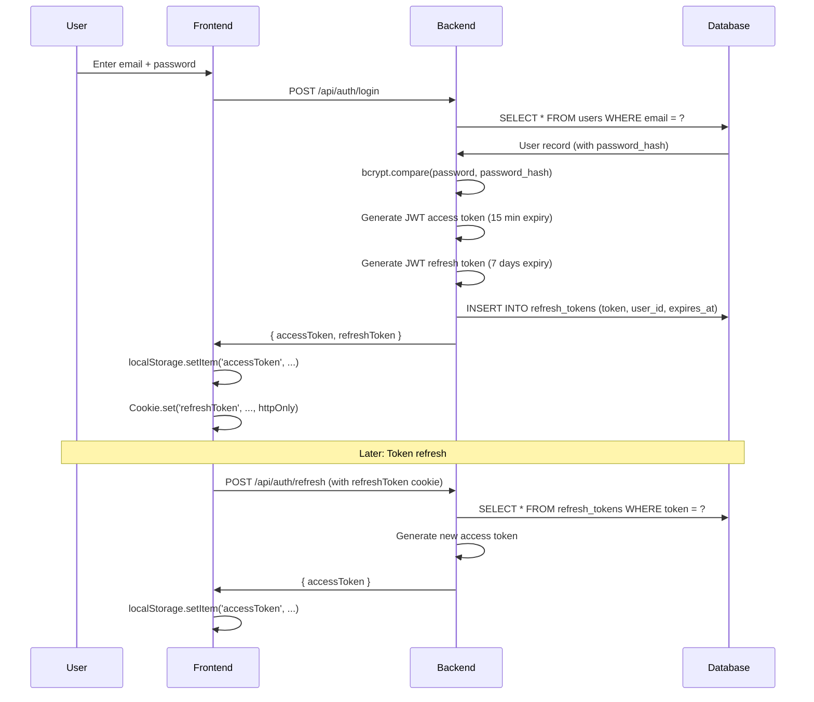
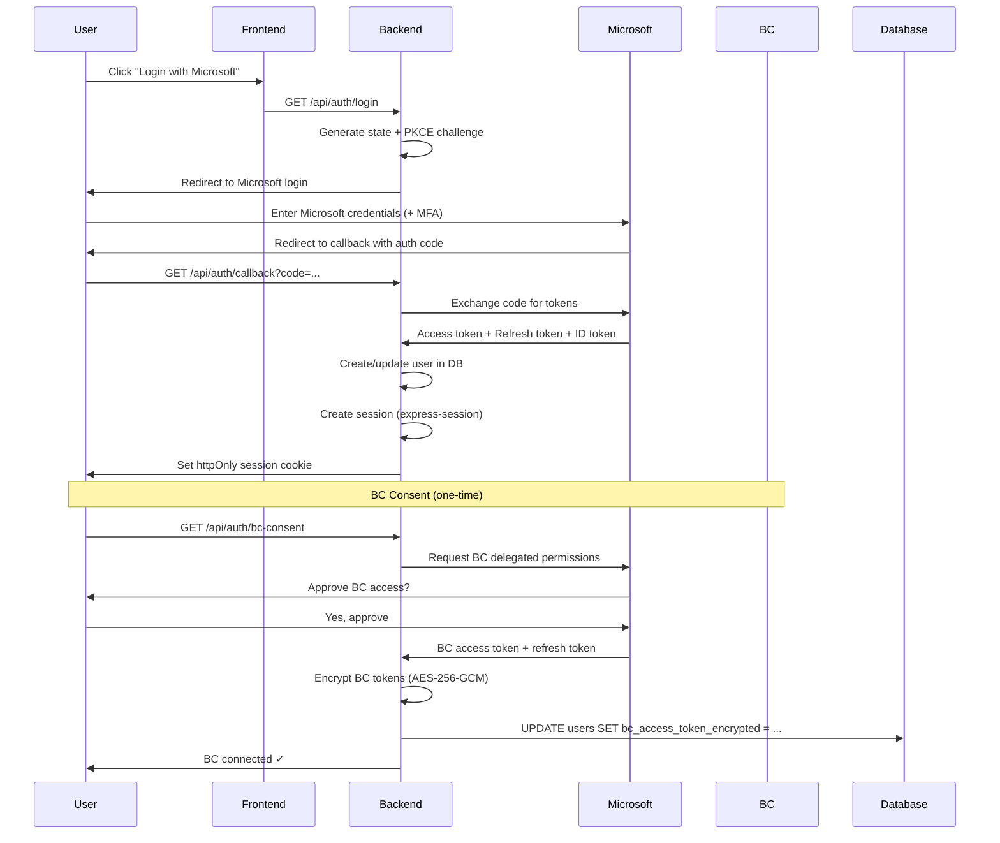

# Deprecated: JWT Authentication

> **Status**: ❌ DEPRECATED (Week 2.5, January 2025)
> **Replaced By**: Microsoft Entra ID OAuth 2.0
> **Reason**: Multi-tenant support, better audit trail, enterprise security

---

## Overview

The BC-Claude-Agent system originally used **JWT (JSON Web Token) authentication** with email/password login. This approach was replaced by **Microsoft Entra ID OAuth 2.0** with delegated permissions in Week 2.5.

**DO NOT reimplement JWT authentication.** This document explains why it was deprecated and what replaced it.

---

## What Was Deprecated

### Old Authentication Flow



### Code Structure (Removed)

```
backend/src/services/auth/AuthService.ts         ~600 lines
  - register(email, password): Hash password with bcrypt, create user
  - login(email, password): Verify password, generate JWT tokens
  - refresh(refreshToken): Validate refresh token, generate new access token
  - logout(refreshToken): Invalidate refresh token in database

backend/src/routes/auth.ts                        ~100 lines
  - POST /api/auth/register
  - POST /api/auth/login
  - POST /api/auth/refresh
  - POST /api/auth/logout

backend/src/middleware/auth.ts                    ~100 lines
  - authenticateJWT: Verify JWT from Authorization header
  - Extract user from JWT payload

frontend/stores/authStore.ts                       ~50 lines
  - Store tokens in localStorage
  - Handle token refresh
  - Check token expiry

frontend/hooks/useAuth.ts                          ~50 lines
  - Login/logout methods
  - Automatic refresh on 401 responses
```

### Database Schema (Removed)

```sql
-- users table (columns removed)
ALTER TABLE users DROP COLUMN password_hash;  -- bcrypt hashed password

-- refresh_tokens table (dropped entirely in Migration 006)
CREATE TABLE refresh_tokens (
    id UNIQUEIDENTIFIER PRIMARY KEY,
    user_id UNIQUEIDENTIFIER NOT NULL,
    token NVARCHAR(500) NOT NULL,
    expires_at DATETIME2 NOT NULL,
    created_at DATETIME2 DEFAULT GETDATE(),
    FOREIGN KEY (user_id) REFERENCES users(id) ON DELETE CASCADE
);
```

### Dependencies (Removed)

```json
{
  "dependencies": {
    "bcrypt": "5.1.1",           // Password hashing
    "jsonwebtoken": "9.0.2"      // JWT generation/verification
  }
}
```

---

## Why It Was Deprecated

### 1. No Multi-Tenant Support

**Problem**: JWT auth used global BC credentials (`BC_CLIENT_ID`, `BC_CLIENT_SECRET` in .env).
- All users shared the same BC service account
- BC operations showed "BCAgentService" in logs, not the actual user
- No way to access different BC tenants per user

**Impact**: Failed compliance requirements for financial systems (audit trail must show real users).

---

### 2. Poor Audit Trail

**Problem**: BC API logs showed all operations from "BCAgentService@example.com"
- Can't trace which human user performed an action
- Compliance violation (SOX, GDPR require per-user audit)
- Debugging difficult (which user created this invalid record?)

**Example BC Log (OLD)**:
```
2025-01-11 14:23:45 - User: BCAgentService@example.com - Action: Created Customer #12345
2025-01-11 14:25:12 - User: BCAgentService@example.com - Action: Updated Sales Order #SO-9876
```

Who actually did this? Unknown.

---

### 3. Security Weaknesses

**Problem**: Password-based auth has inherent risks
- Passwords can be weak ("password123")
- Password reuse across services
- Brute force attacks possible
- No MFA by default
- Password reset flows add complexity

**JWT Tokens in localStorage**:
- Vulnerable to XSS attacks
- Stolen token = full account access until expiry

---

### 4. UX Complexity

**Problem**: Manual token refresh in frontend
- User must handle 401 responses
- Refresh logic in every API call
- Token expiry timing issues (race conditions)
- Logout doesn't invalidate tokens server-side (must wait for expiry)

**Code Complexity** (Frontend):
```typescript
// Every API call needed this logic
const response = await fetch('/api/endpoint', {
  headers: { 'Authorization': `Bearer ${accessToken}` }
});

if (response.status === 401) {
  // Token expired, try refresh
  const newAccessToken = await refreshAuth();
  if (newAccessToken) {
    // Retry original request with new token
    return fetch('/api/endpoint', {
      headers: { 'Authorization': `Bearer ${newAccessToken}` }
    });
  } else {
    // Refresh failed, redirect to login
    redirectToLogin();
  }
}
```

---

### 5. No SSO Support

**Problem**: Users had to create separate accounts for BC-Claude-Agent
- Yet another username/password to remember
- No integration with corporate identity (Microsoft Entra ID, Okta, etc.)
- Difficult user provisioning (manual account creation)

---

## What Replaced It

### Microsoft Entra ID OAuth 2.0

**New Flow**:


### Benefits

1. **Multi-Tenant**: Each user has their own `bc_access_token_encrypted` → access their own BC tenant/company
2. **Real Audit Trail**: BC logs show actual user email (john@example.com), not "BCAgentService"
3. **Enterprise Security**: Leverages Microsoft MFA, conditional access, password policies
4. **SSO**: Users use existing Microsoft credentials, no new password
5. **Simpler UX**: No manual token refresh, session cookies managed by backend
6. **Delegated Permissions**: BC operations use user's own access level (not global service account)

### New Code Structure

```
backend/src/services/auth/
  - MicrosoftOAuthService.ts       ~300 lines (OAuth flow)
  - BCTokenManager.ts              ~200 lines (Token refresh, encryption)
  - EncryptionService.ts           ~150 lines (AES-256-GCM encryption)

backend/src/routes/auth-oauth.ts    ~200 lines
  - GET /api/auth/login             Redirect to Microsoft
  - GET /api/auth/callback          Exchange code for tokens
  - GET /api/auth/bc-consent        Request BC permissions
  - GET /api/auth/me                Get current user
  - POST /api/auth/logout           Destroy session

backend/src/middleware/
  - authenticateMicrosoft.ts        ~50 lines (Check session)
  - requireBCToken.ts               ~50 lines (Check BC token, auto-refresh)

frontend/
  - No token management (cookies handled automatically)
  - API calls use credentials: 'include'
```

### Database Changes

```sql
-- Migration 005: Add OAuth columns
ALTER TABLE users ADD microsoft_user_id NVARCHAR(255) UNIQUE NOT NULL;
ALTER TABLE users ADD bc_access_token_encrypted NVARCHAR(MAX);
ALTER TABLE users ADD bc_refresh_token_encrypted NVARCHAR(MAX);
ALTER TABLE users ADD bc_token_expires_at DATETIME2;
ALTER TABLE users ADD bc_tenant_id NVARCHAR(255);
ALTER TABLE users ADD bc_environment NVARCHAR(255);

-- Drop JWT columns
ALTER TABLE users DROP COLUMN password_hash;

-- Migration 006: Drop JWT table
DROP TABLE IF EXISTS refresh_tokens;
```

---

## Migration Guide

### If You Find JWT Code

**DO NOT USE IT.** Instead:

```typescript
// ❌ WRONG - JWT auth (deprecated)
import { AuthService } from './services/auth/AuthService';
const authService = new AuthService();
await authService.login(email, password);

// ✅ CORRECT - Microsoft OAuth
// Frontend: Redirect to /api/auth/login (handled by backend)
window.location.href = '/api/auth/login';

// Backend: Use authenticateMicrosoft middleware
import { authenticateMicrosoft } from './middleware/authenticateMicrosoft';
app.get('/api/protected', authenticateMicrosoft, (req, res) => {
  const user = req.session.user;  // From session, not JWT
  res.json({ user });
});
```

### If You See JWT Environment Variables

```env
# ❌ WRONG - JWT secrets (deprecated)
JWT_SECRET=...
JWT_ACCESS_EXPIRY=15m
JWT_REFRESH_EXPIRY=7d

# ✅ CORRECT - Microsoft OAuth
MICROSOFT_CLIENT_ID=...
MICROSOFT_CLIENT_SECRET=...
MICROSOFT_TENANT_ID=common
MICROSOFT_REDIRECT_URI=http://localhost:3002/api/auth/callback
SESSION_SECRET=...
ENCRYPTION_KEY=...  # For BC tokens
```

### If You See Password Hashing

```typescript
// ❌ WRONG - Password hashing (deprecated)
import bcrypt from 'bcrypt';
const password_hash = await bcrypt.hash(password, 10);

// ✅ CORRECT - No passwords
// OAuth handles authentication, no password storage needed
```

---

## Performance Comparison

| Metric | JWT (OLD) | OAuth (NEW) |
|--------|-----------|-------------|
| Login latency | ~800ms (bcrypt + JWT gen) | ~1,800ms (OAuth redirect) |
| API call latency | +5ms (JWT verify) | +2ms (session lookup) |
| Refresh latency | ~200ms (JWT gen) | ~800ms (Microsoft token refresh) |
| Security | Medium (password + JWT) | High (Microsoft SSO + MFA) |
| Audit trail | Service account only | Per-user actual identity |
| Multi-tenant | ❌ No | ✅ Yes |

**Verdict**: OAuth is slower (~2x latency on auth operations), but **benefits far outweigh the cost**:
- Multi-tenant support (required feature)
- Real audit trail (compliance requirement)
- Enterprise security (MFA, conditional access)

---

## Common Questions

### Q: Can we use JWT for API-only users (no BC access)?

**A**: No. Even if a user doesn't need BC access, they still authenticate via Microsoft OAuth. This ensures:
- Consistent auth flow across all users
- Future-proof (user might need BC access later)
- Audit trail shows real Microsoft identity

### Q: What if Microsoft Entra ID is down?

**A**: Users cannot log in (same as if BC is down). This is acceptable because:
- Microsoft SLA: 99.99% uptime
- BC also requires Microsoft identity → if Microsoft is down, BC is unusable anyway
- No workaround possible (can't bypass enterprise auth)

### Q: Can we add email/password as fallback?

**A**: NO. This defeats the purpose of OAuth:
- Loses multi-tenant support (no BC delegated tokens)
- Loses audit trail (which auth method was used?)
- Security hole (weak passwords)

**If you need offline access**, use service accounts with client credentials flow (separate from user auth).

### Q: JWT tokens were faster. Why sacrifice performance?

**A**: **Compliance > Performance**. Financial systems require:
- Per-user audit trail (BC logs must show real user)
- Multi-tenant support (different users → different BC companies)
- Enterprise auth (MFA, conditional access)

JWT cannot provide these features, regardless of performance.

---

## Related Documents

- **Microsoft OAuth Setup**: `docs/07-security/06-microsoft-oauth-setup.md`
- **Token Encryption**: `docs/07-security/08-token-encryption.md` (to be created)
- **Direction Changes**: `docs/13-roadmap/07-direction-changes.md` (Direction Change #1)
- **Session Cookies**: `docs/08-state-persistence/09-session-cookies-vs-jwt.md` (to be created)

---

## Lessons Learned

1. **Auth Changes Are Expensive**: ~800 lines removed, ~650 added. Choose auth method carefully upfront.
2. **Compliance Drives Architecture**: Financial systems have non-negotiable requirements (audit trail, multi-tenant).
3. **Performance ≠ Priority**: OAuth is 2x slower than JWT, but provides required features.
4. **User Experience Improved**: Despite backend complexity, users prefer "Login with Microsoft" over username/password.

---

**Deprecated**: 2025-01-11 (Week 2.5)
**Reason**: Multi-tenant support, audit compliance, enterprise security
**Replaced By**: Microsoft Entra ID OAuth 2.0 with delegated permissions
**Status**: ❌ DO NOT USE
