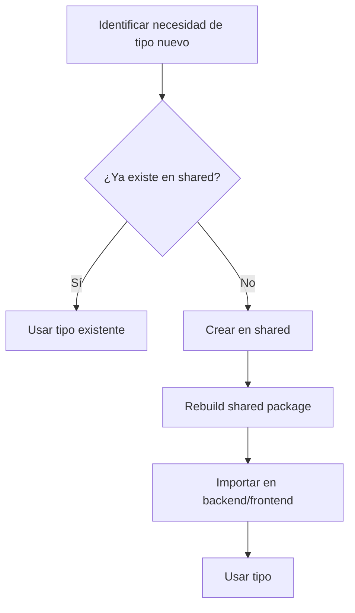

# Integración con Paquete Compartido (@bc-agent/shared)

**Fecha**: 2026-01-13
**Estado**: Implementado
**Versión**: 2.0

---

## Ubicación y Propósito

```
packages/shared/
├── src/
│   ├── types/
│   │   ├── agent.types.ts            # 13 tipos de eventos del agente (sync)
│   │   ├── message.types.ts          # Contrato API (single source of truth)
│   │   ├── websocket.types.ts        # Eventos WebSocket type-safe
│   │   ├── approval.types.ts         # Sistema Human-in-the-Loop
│   │   ├── file.types.ts             # Gestión de archivos
│   │   ├── source.types.ts           # Sistema multi-origen (Blob, SharePoint, etc.)
│   │   ├── error.types.ts            # Respuestas de error estandarizadas
│   │   ├── normalized-events.types.ts # Eventos normalizados multi-provider
│   │   └── index.ts                  # Barrel export
│   ├── schemas/
│   │   └── index.ts                  # 10 esquemas Zod de validación
│   ├── constants/
│   │   ├── errors.ts                 # 42 códigos de error + mensajes
│   │   └── index.ts
│   └── index.ts                      # Root barrel export
└── package.json
```

**El paquete `@bc-agent/shared` es el SINGLE SOURCE OF TRUTH para tipos compartidos.**

---

## Tipos Implementados

### 1. agent.types.ts (Eventos del Agente)

| Tipo | Descripción |
|------|-------------|
| `AgentEventType` | Union de 13 tipos de eventos (sync architecture) |
| `BaseAgentEvent` | Base con eventId, sequenceNumber, persistenceState |
| `SessionStartEvent` | Inicio de sesión |
| `ThinkingEvent` | Contenido de razonamiento extendido |
| `ThinkingCompleteEvent` | Señal de fin de thinking |
| `MessageEvent` | Mensaje completo con tokenUsage |
| `ToolUseEvent` | Invocación de herramienta |
| `ToolResultEvent` | Resultado de herramienta |
| `CompleteEvent` | Terminal con citedFiles |
| `ErrorEvent` | Evento de error |
| `ApprovalRequestedEvent` | Human-in-the-loop request |
| `ApprovalResolvedEvent` | Respuesta a aprobación |
| `UserMessageConfirmedEvent` | Mensaje de usuario persistido |
| `TurnPausedEvent` | Turn pausado (SDK 0.71+) |
| `ContentRefusedEvent` | Contenido rechazado por policy |
| `PersistenceState` | pending, queued, persisted, failed, transient |
| `StopReason` | end_turn, tool_use, max_tokens, etc. |
| `CitedFile` | Archivo citado con sourceType y fetchStrategy |

**Nota**: Los tipos de streaming (`thinking_chunk`, `message_chunk`, `message_partial`) fueron eliminados en la arquitectura síncrona v2.0.

---

### 2. normalized-events.types.ts (Multi-Provider)

Sistema de eventos normalizados independiente del proveedor (Anthropic, OpenAI, Google).

| Tipo | Descripción |
|------|-------------|
| `NormalizedProvider` | 'anthropic', 'openai', 'azure-openai', 'google' |
| `NormalizedAgentEventType` | 8 tipos: session_start, user_message, thinking, tool_request, tool_response, assistant_message, error, complete |
| `NormalizedPersistenceStrategy` | transient, sync_required, async_allowed |
| `NormalizedStopReason` | end_turn, tool_use, max_tokens, error, cancelled |
| `NormalizedTokenUsage` | inputTokens, outputTokens, thinkingTokens, cachedTokens |
| `BaseNormalizedEvent` | Base con originalIndex, persistenceStrategy, preAllocatedSequenceNumber |
| `NormalizedAgentEvent` | Discriminated union de todos los eventos normalizados |

**Type Guards disponibles**:
- `requiresSyncPersistence(event)` - Requiere persistencia síncrona
- `isTransientNormalizedEvent(event)` - Es evento transient
- `allowsAsyncPersistence(event)` - Permite persistencia async
- `isNormalizedThinkingEvent(event)` - Es evento de thinking
- `isNormalizedToolRequestEvent(event)` - Es tool_request
- `isNormalizedToolResponseEvent(event)` - Es tool_response
- `isNormalizedAssistantMessageEvent(event)` - Es assistant_message
- `isNormalizedCompleteEvent(event)` - Es evento complete

---

### 3. source.types.ts (Sistema Multi-Origen)

| Tipo | Descripción |
|------|-------------|
| `SourceType` | 'blob_storage', 'sharepoint', 'onedrive', 'email', 'web' |
| `FetchStrategy` | 'internal_api', 'oauth_proxy', 'external' |
| `SourceExcerpt` | Fragmento de documento con score y chunkIndex |
| `DEFAULT_SOURCE_TYPE` | 'blob_storage' |
| `DEFAULT_FETCH_STRATEGY` | 'internal_api' |

**Función helper**:
```typescript
getFetchStrategy(sourceType: SourceType): FetchStrategy
// blob_storage → internal_api
// sharepoint/onedrive/email → oauth_proxy
// web → external
```

---

### 4. error.types.ts (Respuestas de Error)

| Tipo | Descripción |
|------|-------------|
| `ApiErrorResponse` | Estructura estándar: error, message, code, details?, requestId? |
| `ErrorResponseWithStatus` | Respuesta con statusCode + body |
| `ValidationErrorDetail` | field, message, expected?, received? |
| `RangeErrorDetail` | field, min, max, received |

**Type Guards**:
- `isApiErrorResponse(obj)` - Valida estructura de error
- `isValidErrorCode(code)` - Valida código de error

---

### 5. message.types.ts (Contrato API)

| Tipo | Descripción |
|------|-------------|
| `Message` | Discriminated union de mensajes |
| `TokenUsage` | { input_tokens, output_tokens } |

---

### 6. websocket.types.ts (Eventos WebSocket)

| Tipo | Descripción |
|------|-------------|
| `ChatMessageData` | Input del WebSocket |
| Otros eventos WebSocket type-safe |

---

### 7. approval.types.ts (Human-in-the-Loop)

| Tipo | Descripción |
|------|-------------|
| `ApprovalRequest` | Solicitud de aprobación |
| `ApprovalResponse` | Respuesta (approved/rejected) |

---

### 8. file.types.ts (Gestión de Archivos)

| Tipo | Descripción |
|------|-------------|
| Tipos para gestión de archivos y uploads |

---

## Esquemas Zod (10 Schemas)

```typescript
import {
  chatMessageSchema,
  agentQuerySchema,
  approvalResponseSchema,
  sessionJoinSchema,
  sessionLeaveSchema,
  todoCreateSchema,
  bcQuerySchema,
  extendedThinkingConfigSchema,
  fullChatMessageSchema,
  stopAgentSchema,
  validateOrThrow,
  validateSafe,
  z  // Re-export de Zod
} from '@bc-agent/shared';
```

| Schema | Validación |
|--------|------------|
| `chatMessageSchema` | message (1-10000 chars), sessionId (UUID), userId (UUID) |
| `agentQuerySchema` | prompt, sessionId?, userId, streaming, maxTurns (1-50) |
| `approvalResponseSchema` | approvalId, decision (approved/rejected), userId, reason? |
| `sessionJoinSchema` | sessionId, userId |
| `sessionLeaveSchema` | sessionId |
| `todoCreateSchema` | sessionId, content, activeForm, order? |
| `bcQuerySchema` | entity (enum), filter?, select?, expand?, orderBy?, top?, skip?, count? |
| `extendedThinkingConfigSchema` | enableThinking?, thinkingBudget? (min 1024) |
| `fullChatMessageSchema` | chatMessage + thinking config |
| `stopAgentSchema` | sessionId, userId |

**Helpers de validación**:
```typescript
// Throws ZodError on failure
const data = validateOrThrow(chatMessageSchema, req.body);

// Returns Result type
const result = validateSafe(chatMessageSchema, req.body);
if (result.success) {
  console.log(result.data.message);
} else {
  console.log(result.error.errors);
}
```

---

## Códigos de Error (42 Códigos)

```typescript
import { ErrorCode, ERROR_MESSAGES, ERROR_STATUS_CODES } from '@bc-agent/shared';
```

### Categorías de Error

| Categoría | HTTP | Ejemplos |
|-----------|------|----------|
| **Bad Request** | 400 | `VALIDATION_ERROR`, `INVALID_PARAMETER`, `MISSING_REQUIRED_FIELD`, `PARAMETER_OUT_OF_RANGE` |
| **Unauthorized** | 401 | `UNAUTHORIZED`, `SESSION_EXPIRED`, `INVALID_TOKEN`, `USER_ID_NOT_IN_SESSION` |
| **Forbidden** | 403 | `FORBIDDEN`, `ACCESS_DENIED`, `SESSION_ACCESS_DENIED`, `APPROVAL_ACCESS_DENIED` |
| **Not Found** | 404 | `NOT_FOUND`, `SESSION_NOT_FOUND`, `USER_NOT_FOUND`, `APPROVAL_NOT_FOUND`, `TOOL_NOT_FOUND` |
| **Conflict** | 409 | `CONFLICT`, `ALREADY_EXISTS`, `ALREADY_RESOLVED`, `STATE_CONFLICT` |
| **Gone** | 410 | `EXPIRED`, `APPROVAL_EXPIRED` |
| **Rate Limit** | 429 | `RATE_LIMIT_EXCEEDED`, `SESSION_RATE_LIMIT_EXCEEDED` |
| **Internal** | 500 | `INTERNAL_ERROR`, `DATABASE_ERROR`, `SERVICE_ERROR`, `SESSION_CREATE_ERROR` |
| **Unavailable** | 503 | `SERVICE_UNAVAILABLE`, `AGENT_BUSY`, `BC_UNAVAILABLE`, `MCP_UNAVAILABLE` |

**Funciones helper**:
```typescript
getHttpStatusName(statusCode: number): string
getErrorMessage(code: ErrorCode): string
getErrorStatusCode(code: ErrorCode): number
validateErrorConstants(): void  // Para startup validation
```

---

## Regla de Herencia: Backend EXTIENDE Shared

### PATRÓN OBLIGATORIO

```typescript
// ❌ INCORRECTO - No crear tipos duplicados
interface BackendMessage {
  id: string;
  content: string;
  // ... duplicando campos de shared
}

// ✅ CORRECTO - Extender desde shared
import { BaseAgentEvent, Message } from '@bc-agent/shared';

// Backend extiende con campos internos
interface BackendAgentEvent extends BaseAgentEvent {
  // Campos solo para backend (auditoría, trazabilidad)
  internalEventId?: string;
  dbSequenceNumber?: number;
  processingLatencyMs?: number;
}

// Backend puede agregar metadatos internos
interface BackendMessageContext {
  message: Message;                    // Del shared
  auditTrail: AuditEntry[];           // Solo backend
  encryptedTokens?: string;           // Solo backend
}
```

---

## Separación de Campos: Frontend vs Backend

| Campo | Frontend | Backend | Razón |
|-------|----------|---------|-------|
| `id`, `session_id`, `content` | ✅ | ✅ | Necesario en ambos |
| `sequence_number` | ✅ | ✅ | Ordering |
| `token_usage` | ✅ | ✅ | Mostrar al usuario |
| `citedFiles` | ✅ | ✅ | Citas clickeables |
| `preAllocatedSequenceNumber` | ❌ | ✅ | Pre-allocation interna |
| `originalIndex` | ❌ | ✅ | Ordenamiento normalización |
| `persistenceStrategy` | ❌ | ✅ | Lógica de persistencia |
| `processingLatencyMs` | ❌ | ✅ | Monitoreo interno |
| `encryptedBCToken` | ❌ | ✅ | Seguridad |
| `dbRowVersion` | ❌ | ✅ | Concurrencia optimista |
| `auditUserId` | ❌ | ✅ | Auditoría GDPR |

---

## Cómo las Clases del Backend Usan Shared

### Ejemplo: PersistenceCoordinator

```typescript
// PersistenceCoordinator.ts
import {
  BaseAgentEvent,
  PersistenceState,
  NormalizedAgentEvent,
  requiresSyncPersistence,
  allowsAsyncPersistence
} from '@bc-agent/shared';

interface PersistedEvent {
  // Campos del shared
  eventId: string;
  sequenceNumber: number;
  timestamp: string;
  persistenceState: PersistenceState;

  // Campos solo backend
  dbRowId?: number;
  processingTimeMs?: number;
}

// Uso de type guards
async processBatch(events: NormalizedAgentEvent[]) {
  for (const event of events) {
    if (requiresSyncPersistence(event)) {
      await this.persistSync(event);
    } else if (allowsAsyncPersistence(event)) {
      this.queueAsync(event);
    }
  }
}
```

### Ejemplo: AgentOrchestrator

```typescript
// AgentOrchestrator.ts
import {
  AgentEvent,
  NormalizedAgentEvent,
  isNormalizedAssistantMessageEvent,
  isNormalizedToolRequestEvent
} from '@bc-agent/shared';

// Normalización y emisión
processNormalizedEvent(event: NormalizedAgentEvent): AgentEvent {
  if (isNormalizedAssistantMessageEvent(event)) {
    return {
      type: 'message',
      content: event.content,
      messageId: event.messageId,
      // ... mapeo completo
    };
  }
  // ... otros tipos
}
```

### Ejemplo: BatchResultNormalizer

```typescript
// BatchResultNormalizer.ts
import {
  NormalizedAgentEvent,
  NormalizedAssistantMessageEvent,
  NormalizedToolRequestEvent,
  NormalizedTokenUsage
} from '@bc-agent/shared';

// Normaliza AgentState de LangGraph a eventos estándar
normalize(result: AgentState): NormalizedAgentEvent[] {
  const events: NormalizedAgentEvent[] = [];
  // ... lógica de normalización
  return events;
}
```

---

## Reglas de Oro

### ✅ DO

1. **Siempre importar tipos de shared cuando existan**
   ```typescript
   import { Message, TokenUsage, ErrorCode } from '@bc-agent/shared';
   ```

2. **Usar type guards para narrowing**
   ```typescript
   import { NormalizedAgentEvent, isNormalizedThinkingEvent } from '@bc-agent/shared';

   function handleEvent(event: NormalizedAgentEvent) {
     if (isNormalizedThinkingEvent(event)) {
       console.log(event.content); // TypeScript sabe los campos
     }
   }
   ```

3. **Usar schemas Zod para validación**
   ```typescript
   import { chatMessageSchema, validateSafe } from '@bc-agent/shared';

   const result = validateSafe(chatMessageSchema, req.body);
   if (!result.success) {
     return res.status(400).json({ errors: result.error.errors });
   }
   ```

4. **Usar ErrorCode para respuestas de error**
   ```typescript
   import { ErrorCode, getErrorMessage, getErrorStatusCode } from '@bc-agent/shared';

   return res.status(getErrorStatusCode(ErrorCode.SESSION_NOT_FOUND)).json({
     error: 'Not Found',
     message: getErrorMessage(ErrorCode.SESSION_NOT_FOUND),
     code: ErrorCode.SESSION_NOT_FOUND
   });
   ```

### ❌ DON'T

1. **No duplicar tipos que ya existen en shared**
   ```typescript
   // ❌ INCORRECTO
   interface Message {
     id: string;
     content: string;
   }
   ```

2. **No hardcodear códigos de error**
   ```typescript
   // ❌ INCORRECTO
   return res.status(404).json({ message: 'Session not found' });

   // ✅ CORRECTO
   import { ErrorCode } from '@bc-agent/shared';
   return sendError(res, ErrorCode.SESSION_NOT_FOUND);
   ```

3. **No usar `any` para evitar importar de shared**
   ```typescript
   // ❌ INCORRECTO
   function handleEvent(event: any) { ... }

   // ✅ CORRECTO
   import { AgentEvent } from '@bc-agent/shared';
   function handleEvent(event: AgentEvent) { ... }
   ```

---

## Workflow de Cambios en Shared



**Comandos**:
```bash
# Build shared
npm run build:shared

# Verify types across workspace
npm run verify:types
```

---

## Checklist de Integración

Al implementar cada nueva clase:

- [ ] Revisar tipos en `@bc-agent/shared` antes de crear tipos propios
- [ ] Importar tipos existentes del shared
- [ ] Usar type guards para narrowing de eventos
- [ ] Usar schemas Zod para validación de input
- [ ] Usar ErrorCode para respuestas de error
- [ ] Extender (no duplicar) tipos del shared para campos backend-only
- [ ] Documentar por qué se agregaron campos backend-only
- [ ] Verificar que tipos compartidos se usen en interfaces públicas
- [ ] Agregar nuevos tipos a shared si se necesitan en frontend y backend

---

*Última actualización: 2026-01-13*
