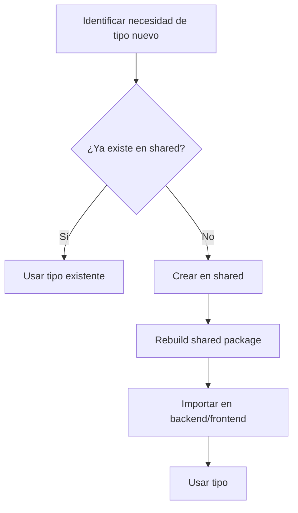

# Integración con Paquete Compartido (@bc-agent/shared)

**Fecha**: 2025-12-22
**Estado**: Aprobado

---

## Ubicación y Propósito

```
packages/shared/
├── src/
│   ├── types/
│   │   ├── agent.types.ts      # 17 tipos de eventos del agente
│   │   ├── message.types.ts    # Contrato API (single source of truth)
│   │   ├── websocket.types.ts  # Eventos WebSocket type-safe
│   │   ├── approval.types.ts   # Sistema Human-in-the-Loop
│   │   └── file.types.ts       # Gestión de archivos
│   ├── schemas/                # Esquemas Zod compartidos
│   └── constants/              # ErrorCodes, limites, etc.
└── package.json
```

**El paquete `@bc-agent/shared` es el SINGLE SOURCE OF TRUTH para tipos compartidos.**

---

## Tipos que YA EXISTEN en @bc-agent/shared

| Tipo | Archivo | Uso |
|------|---------|-----|
| `BaseAgentEvent` | agent.types.ts | Base para todos los eventos |
| `AgentEventType` | agent.types.ts | Union de 17 tipos de eventos |
| `PersistenceState` | agent.types.ts | pending, queued, persisted, failed, transient |
| `Message` | message.types.ts | Discriminated union de mensajes |
| `TokenUsage` | message.types.ts | { input_tokens, output_tokens } |
| `ChatMessageData` | websocket.types.ts | Input del WebSocket |
| `ApprovalRequest` | approval.types.ts | Sistema de aprobaciones |

---

## Regla de Herencia: Backend EXTIENDE Shared

### PATRÓN OBLIGATORIO

```typescript
// ❌ INCORRECTO - No crear tipos duplicados
interface BackendMessage {
  id: string;
  content: string;
  // ... duplicando campos de shared
}

// ✅ CORRECTO - Extender desde shared
import { BaseAgentEvent, Message } from '@bc-agent/shared';

// Backend extiende con campos internos
interface BackendAgentEvent extends BaseAgentEvent {
  // Campos solo para backend (auditoría, trazabilidad)
  internalEventId?: string;
  dbSequenceNumber?: number;
  processingLatencyMs?: number;
}

// Backend puede agregar metadatos internos
interface BackendMessageContext {
  message: Message;                    // Del shared
  auditTrail: AuditEntry[];           // Solo backend
  encryptedTokens?: string;           // Solo backend
}
```

---

## Separación de Campos: Frontend vs Backend

| Campo | Frontend | Backend | Razón |
|-------|----------|---------|-------|
| `id`, `session_id`, `content` | ✅ | ✅ | Necesario en ambos |
| `sequence_number` | ✅ | ✅ | Ordering |
| `token_usage` | ✅ | ✅ | Mostrar al usuario |
| `event_id` | ❌ | ✅ | Trazabilidad interna |
| `tool_use_id` (correlación) | ❌ | ✅ | Solo para debugging |
| `processingLatencyMs` | ❌ | ✅ | Monitoreo interno |
| `encryptedBCToken` | ❌ | ✅ | Seguridad |
| `dbRowVersion` | ❌ | ✅ | Concurrencia optimista |
| `auditUserId` | ❌ | ✅ | Auditoría GDPR |

---

## Cómo las Nuevas Clases Deben Usar Shared

### Ejemplo: PersistenceCoordinator

```typescript
// PersistenceCoordinator.ts
import {
  BaseAgentEvent,
  PersistenceState,
  AgentEventType
} from '@bc-agent/shared';

interface PersistedEvent {
  // Campos del shared
  eventId: string;
  sequenceNumber: number;
  timestamp: string;
  persistenceState: PersistenceState;  // Usa el tipo del shared

  // Campos solo backend
  dbRowId?: number;
  processingTimeMs?: number;
}
```

### Ejemplo: AgentEventEmitter

```typescript
// AgentEventEmitter.ts
import { AgentEvent, BaseAgentEvent } from '@bc-agent/shared';

interface IAgentEventEmitter {
  // Emite tipos del shared (van al frontend)
  emit(event: AgentEvent): void;

  // Métodos internos pueden usar tipos extendidos
  emitWithAudit(event: AgentEvent, audit: AuditContext): void;
}
```

### Ejemplo: GraphStreamProcessor

```typescript
// GraphStreamProcessor.ts
import { TokenUsage, AgentEvent } from '@bc-agent/shared';

type ProcessedStreamEvent =
  | { type: 'thinking_chunk'; content: string; blockIndex: number }
  | { type: 'message_chunk'; content: string; blockIndex: number }
  | { type: 'tool_execution'; execution: ToolExecution }
  | { type: 'turn_end'; content: string; stopReason: string }
  | { type: 'final_response'; content: string; stopReason: string }
  | { type: 'usage'; usage: TokenUsage };  // TokenUsage del shared
```

---

## Actualización del Paquete Shared (Si Necesario)

Si el refactor requiere NUEVOS tipos compartidos:

1. **Crear en shared primero**: `packages/shared/src/types/newtype.types.ts`
2. **Exportar desde index**: `packages/shared/src/types/index.ts`
3. **Rebuild shared**: `cd packages/shared && npm run build`
4. **Importar en backend/frontend**: `import { NewType } from '@bc-agent/shared'`

### Tipos propuestos para agregar a shared

```typescript
// Posible adición a agent.types.ts
export interface ProcessedStreamEvent {
  type: 'thinking_chunk' | 'message_chunk' | 'tool_execution' | 'usage';
  content?: string;
  blockIndex: number;
  timestamp: string;
}

// Posible adición a file.types.ts
export interface ImageSearchResult {
    fileId: string;
    fileName: string;
    score: number;
    thumbnailUrl?: string;
}

export interface ImageSearchResponse {
    results: ImageSearchResult[];
    query: string;
    totalResults: number;
}
```

---

## Reglas de Oro

### ✅ DO

1. **Siempre importar tipos de shared cuando existan**
   ```typescript
   import { Message, TokenUsage } from '@bc-agent/shared';
   ```

2. **Extender tipos del shared para agregar campos backend-only**
   ```typescript
   interface BackendMessage extends Message {
     dbRowId: number;
     encryptedData?: string;
   }
   ```

3. **Usar tipos discriminados del shared**
   ```typescript
   import { AgentEvent } from '@bc-agent/shared';

   function handleEvent(event: AgentEvent) {
     switch (event.type) {
       case 'thinking': // TypeScript sabe los campos disponibles
         console.log(event.content);
         break;
       case 'message':
         console.log(event.content);
         break;
     }
   }
   ```

### ❌ DON'T

1. **No duplicar tipos que ya existen en shared**
   ```typescript
   // ❌ INCORRECTO
   interface Message {
     id: string;
     content: string;
   }
   ```

2. **No agregar campos frontend-only al backend**
   ```typescript
   // ❌ INCORRECTO
   interface BackendEvent {
     uiHighlight: boolean;  // Esto es frontend concern
   }
   ```

3. **No usar `any` para evitar importar de shared**
   ```typescript
   // ❌ INCORRECTO
   function handleEvent(event: any) { ... }

   // ✅ CORRECTO
   import { AgentEvent } from '@bc-agent/shared';
   function handleEvent(event: AgentEvent) { ... }
   ```

---

## Workflow de Cambios en Shared



---

## Checklist de Integración

Al implementar cada nueva clase:

- [ ] Revisar tipos en `@bc-agent/shared` antes de crear tipos propios
- [ ] Importar tipos existentes del shared
- [ ] Extender (no duplicar) tipos del shared para campos backend-only
- [ ] Documentar por qué se agregaron campos backend-only
- [ ] Verificar que tipos compartidos se usen en interfaces públicas
- [ ] Agregar nuevos tipos a shared si se necesitan en frontend y backend

---

*Última actualización: 2025-12-22*
