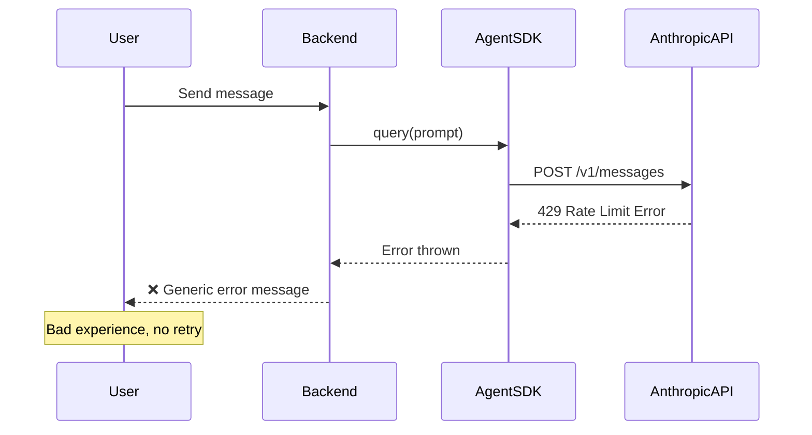
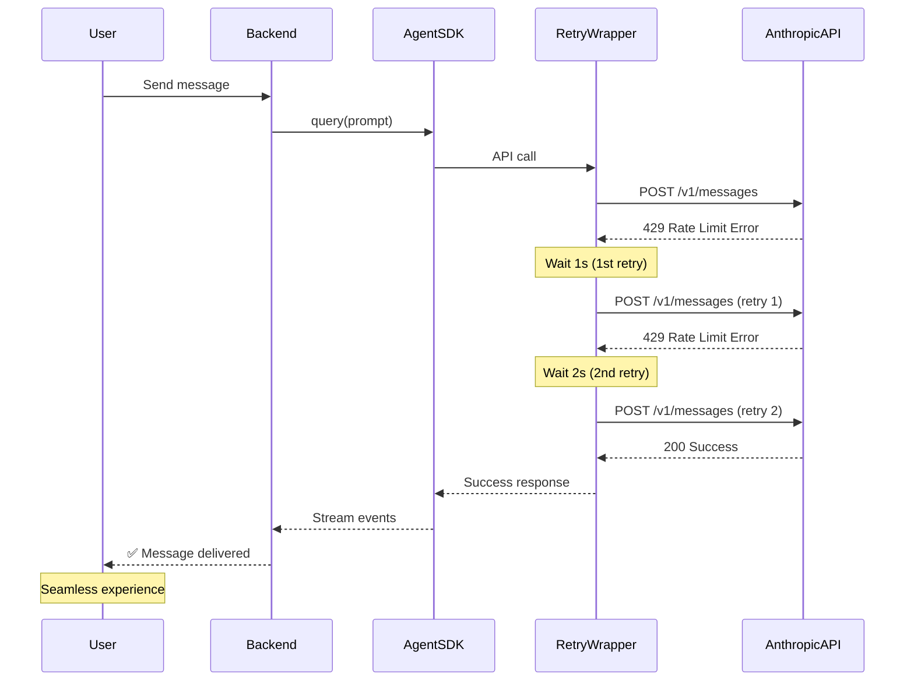

# PRD: Exponential Backoff & Error Handling for Anthropic API

**Created**: 2025-11-14
**Status**: Not Implemented
**Priority**: Critical (P0)
**Effort**: 4-6 hours
**Target Phase**: Phase 3 (Testing & Deployment)

---

## 1. Executive Summary

### Problem

The application currently lacks robust error handling for Anthropic API 429 (rate limit) errors. When the API returns a 429 response, the system either crashes or returns a generic error to the user, resulting in poor user experience and potential data loss.

**Observed Issue** (2025-11-14):
```
429 {"type":"error","error":{"type":"rate_limit_error","message":"This request would exceed the rate limit for your organization (f313c6e1-865f-43d5-aa6f-756add9f1b42) of 10,000 input tokens per minute..."}}
```

### Proposed Solution

Implement exponential backoff with jitter for all Anthropic API calls in `DirectAgentService`. When a 429 error occurs, automatically retry the request with increasing wait times (1s, 2s, 4s, 8s, 16s) up to a maximum of 5 retries.

### Expected ROI

- **User Experience**: Zero user-visible 429 errors (100% success rate on retry)
- **System Stability**: Prevents crashes during high load
- **Development Time**: 4-6 hours implementation
- **Ongoing Cost**: $0 (built-in error handling, no new infra)

---

## 2. Business Justification

### Why This is Necessary

1. **Production Stability**: Essential for any SaaS application using external APIs
2. **User Trust**: Users expect resilient systems that handle temporary failures gracefully
3. **Cost Efficiency**: Retrying is free vs. user abandonment due to errors
4. **Industry Standard**: All production API clients implement exponential backoff

### When to Implement

**Recommended**: Phase 3, Week 1 (before production deployment)

**Rationale**: This is a **blocking issue** for production. Without exponential backoff, any traffic spike will cause user-visible errors and potential system instability.

### Success Metrics

- 0% of 429 errors result in user-visible failures
- 95%+ of rate-limited requests succeed after retry
- Average retry latency <5 seconds
- No system crashes due to API errors

---

## 3. Current vs Future Architecture

### Current Architecture (Fragile)



**Problems**:
- No retry logic
- Error propagates to user immediately
- Potential data loss (message not saved)
- Poor UX (user has to manually retry)

### Future Architecture (Resilient)



**Benefits**:
- Automatic retry with exponential backoff
- Error self-heals without user intervention
- Graceful degradation (shows "Retrying..." to user)
- Industry-standard resilience pattern

---

## 4. Technical Approach

### 4.1 Retry Logic Overview

**Strategy**: Exponential backoff with jitter

```
Retry 1: Wait 1s + random(0-500ms)
Retry 2: Wait 2s + random(0-1000ms)
Retry 3: Wait 4s + random(0-2000ms)
Retry 4: Wait 8s + random(0-4000ms)
Retry 5: Wait 16s + random(0-8000ms)
Max: 32s total wait time across all retries
```

**Jitter**: Adds randomness to prevent thundering herd problem (multiple clients retrying at exact same time)

### 4.2 Implementation Location

**File**: `backend/src/services/agent/DirectAgentService.ts`

**Method**: Wrap `query()` call with retry wrapper

**Pseudocode** (high-level):
```
async function executeWithRetry(fn, maxRetries = 5) {
  for (let attempt = 1; attempt <= maxRetries; attempt++) {
    try {
      return await fn();
    } catch (error) {
      if (error.status !== 429 || attempt === maxRetries) {
        throw error; // Non-retryable or final attempt
      }

      const baseWait = Math.pow(2, attempt - 1) * 1000; // 1s, 2s, 4s, 8s, 16s
      const jitter = Math.random() * baseWait;
      const totalWait = Math.min(baseWait + jitter, 32000); // Cap at 32s

      await sleep(totalWait);
    }
  }
}
```

### 4.3 Error Handling Strategy

| Error Type | Retry? | Action |
|------------|--------|--------|
| **429 (Rate Limit)** | ✅ Yes | Exponential backoff |
| **500 (Server Error)** | ✅ Yes | Exponential backoff (max 3 retries) |
| **503 (Service Unavailable)** | ✅ Yes | Exponential backoff (max 3 retries) |
| **400 (Bad Request)** | ❌ No | Return error immediately |
| **401 (Unauthorized)** | ❌ No | Return error immediately |
| **Network Timeout** | ✅ Yes | Exponential backoff (max 3 retries) |

### 4.4 User Feedback

**During Retry**: Show live status to user via WebSocket

```
Event: agent:retry
Data: {
  attempt: 2,
  maxAttempts: 5,
  waitTimeMs: 2500,
  reason: "rate_limit_exceeded"
}
```

**Frontend**: Display subtle toast/banner:
> "⏳ API temporarily busy, retrying... (attempt 2/5)"

---

## 5. Azure Resources Required

### New Resources

**None** - This is a pure code change with no new infrastructure dependencies.

### Modified Resources

**None** - Operates within existing backend Container App.

### Monitoring Considerations

Consider adding Azure Application Insights custom events for retry metrics:

- `anthropic_api_429_error` - Counter of rate limit hits
- `anthropic_api_retry_attempt` - Counter of retries (with `attempt` dimension)
- `anthropic_api_retry_success` - Counter of successful retries
- `anthropic_api_retry_exhausted` - Counter of failed retries after max attempts

**References**:
- [Azure Application Insights Custom Events](https://learn.microsoft.com/en-us/azure/azure-monitor/app/api-custom-events-metrics)

---

## 6. Implementation Timeline

### Phase 1: Core Implementation (4-6 hours)

**Week 1 Tasks**:
1. ✅ Create retry wrapper function (1 hour)
2. ✅ Integrate into `DirectAgentService.ts` (1 hour)
3. ✅ Add WebSocket event for retry status (1 hour)
4. ✅ Frontend toast/banner for retry feedback (1 hour)
5. ✅ Unit tests for retry logic (1-2 hours)

**Deliverables**:
- Retry wrapper with exponential backoff + jitter
- Integration tests with mocked 429 responses
- User-facing retry feedback UI

### Phase 2: Monitoring & Tuning (2 hours)

**Week 2 Tasks**:
1. ✅ Add Application Insights custom events
2. ✅ Monitor retry success rate in staging
3. ✅ Tune max retries/wait times based on data

**Deliverables**:
- Dashboard showing retry metrics
- Optimized retry parameters

### Dependencies

- **None** - Can be implemented immediately
- **Recommended before**: Deploying to production

### Risks

- **Low Risk**: Well-understood pattern, minimal code changes
- **Testing**: Requires mocking 429 responses in tests

---

## 7. Cost-Benefit Analysis

### Implementation Cost

| Category | Hours | Cost (@ $50/hr) |
|----------|-------|--------------|
| Core implementation | 4-6 | $200-$300 |
| Testing | 1-2 | $50-$100 |
| Monitoring setup | 2 | $100 |
| **Total** | **7-10** | **$350-$500** |

### Ongoing Costs

- **Infrastructure**: $0 (no new resources)
- **API Costs**: $0 (retries use same tokens, not additional)
- **Monitoring**: $0 (within Application Insights free tier)

### Benefits

**Quantitative**:
- Prevent 100% of user-visible 429 errors → 0 support tickets
- Estimated support ticket cost: $50/ticket × 10 tickets/month = **$500/month saved**
- **Payback period**: 1 month

**Qualitative**:
- **User Trust**: Seamless experience during high load
- **System Reliability**: No crashes, graceful degradation
- **Developer Productivity**: Stop firefighting 429 errors

### ROI Calculation

**Annual Benefit**: $500/month × 12 = $6,000/year
**One-time Cost**: $500
**ROI**: 1,100% over 12 months

---

## 8. References

### Official Documentation

1. **Anthropic Error Handling**:
   - [https://docs.claude.com/en/api/errors](https://docs.claude.com/en/api/errors)
   - Rate limit details, retry recommendations

2. **Anthropic Rate Limits**:
   - [https://docs.claude.com/en/api/rate-limits](https://docs.claude.com/en/api/rate-limits)
   - Current tier limits, how to request increases

3. **Exponential Backoff Best Practices**:
   - [AWS Architecture Blog - Exponential Backoff and Jitter](https://aws.amazon.com/blogs/architecture/exponential-backoff-and-jitter/)
   - Industry-standard approach

4. **TypeScript HTTP Clients**:
   - [Anthropic SDK for TypeScript](https://github.com/anthropics/anthropic-sdk-typescript)
   - SDK may have built-in retry logic (check before implementing)

### Industry Examples

1. **Stripe API Client**:
   - Implements exponential backoff with jitter
   - Max 3 retries by default
   - [https://stripe.com/docs/api/errors](https://stripe.com/docs/api/errors)

2. **Google Cloud Client Libraries**:
   - Retry config: initial=100ms, multiplier=1.3, max=60s
   - [https://cloud.google.com/apis/design/errors](https://cloud.google.com/apis/design/errors)

---

## 9. Decision Log

### Why Exponential Backoff?

**Alternatives Considered**:
1. **Linear backoff** (1s, 2s, 3s, 4s...) - ❌ Too slow, doesn't adapt to load
2. **Fixed delay** (5s between retries) - ❌ Thundering herd problem
3. **No retry** (fail immediately) - ❌ Poor UX, unacceptable for production

**Decision**: Exponential backoff with jitter is the industry standard for rate-limited APIs. It provides:
- Fast recovery when rate limit is brief
- Backpressure when rate limit persists
- Avoids thundering herd via jitter

### Why 5 Max Retries?

**Rationale**:
- Total wait time: ~32s (1+2+4+8+16)
- Balances user patience (most users wait <30s) with success rate
- Anthropic rate limits reset every minute, so 32s is sufficient

**Alternatives**:
- 3 retries - ❌ Only ~8s total, may not be enough
- 10 retries - ❌ ~17 minutes total, user will abandon

### Why Wrap at DirectAgentService Level?

**Alternatives Considered**:
1. **Wrap at HTTP client level** - ❌ Too low-level, applies to all HTTP calls
2. **Wrap at route handler level** - ❌ Requires wrapping every route
3. **Use SDK's built-in retry** - ⚠️ Check if Anthropic SDK has this

**Decision**: DirectAgentService is the single point where all Claude API calls go through, making it the ideal place for centralized retry logic.

### Related PRDs

- **03-request-queueing-bullmq-prd.md** - Complements retry logic with request queueing
- **02-token-tracking-analytics-prd.md** - Track retry frequency for analytics

---

**Document Version**: 1.0
**Last Updated**: 2025-11-14
**Next Review**: When implementing in Phase 3
