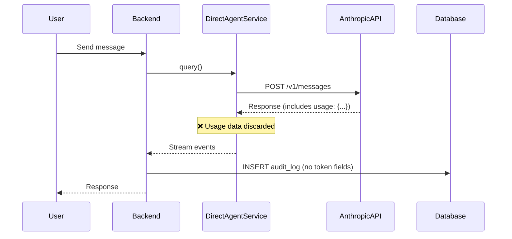
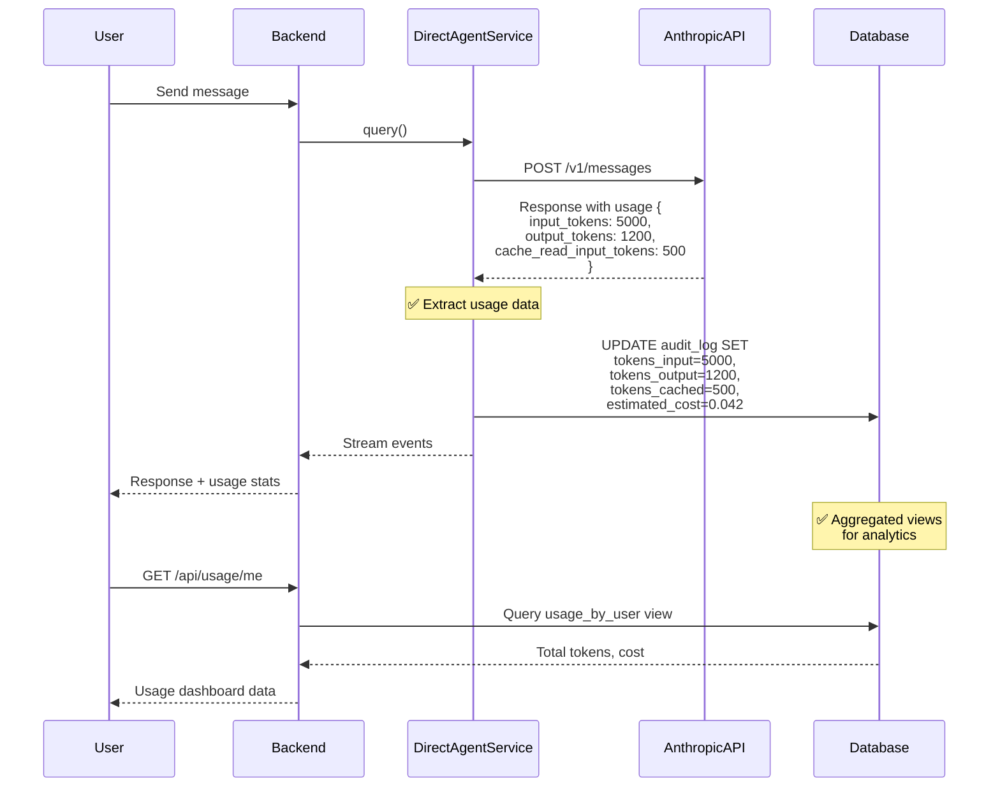

# PRD: Token Tracking & Usage Analytics

**Created**: 2025-11-14
**Status**: Not Implemented
**Priority**: High (P1)
**Effort**: 6-8 hours
**Target Phase**: Phase 3 (Testing & Deployment)

---

## 1. Executive Summary

### Problem

The application currently does not track token usage per request, per user, or per session. This creates multiple issues:

1. **No billing foundation** - Cannot charge users based on actual usage
2. **No cost visibility** - Cannot see which users/sessions are most expensive
3. **No optimization insights** - Cannot identify high-cost patterns to optimize
4. **No budget alerts** - Users cannot see their usage or receive warnings before hitting limits

### Proposed Solution

Implement comprehensive token tracking by:
1. Adding token usage columns to `audit_log` table
2. Capturing token counts from every Anthropic API response
3. Creating aggregated views for per-user and per-session analytics
4. Building frontend dashboard showing token usage and estimated costs

### Expected ROI

- **Revenue Enablement**: Foundation for usage-based billing ($10K-$50K/year potential revenue)
- **Cost Optimization**: Identify 20-30% of wasteful requests to optimize
- **User Transparency**: Builds trust, reduces support tickets
- **Implementation**: 6-8 hours one-time investment

---

## 2. Business Justification

### Why This is Necessary

#### Foundation for SaaS Billing

Modern AI SaaS products use **usage-based pricing** (per token, per message, or per task). Without token tracking, you cannot:
- Charge users accurately
- Offer tiered pricing (e.g., 100K tokens/month on Pro plan)
- Implement quota enforcement

**Industry Examples**:
- **OpenAI API**: $3/1M input tokens, $15/1M output tokens
- **Cursor**: $20/month for 500 requests
- **Replit**: Effort-based pricing (complexity determines cost)

#### Cost Visibility & Optimization

Tracking token usage reveals:
- Which users are most expensive (20% of users = 80% of cost)
- Which types of queries consume most tokens (optimize system prompts)
- When to implement caching (high repeat query patterns)

**Expected Savings**: 20-30% of API costs through optimization insights.

#### User Trust & Transparency

Users want to see:
- "You've used 25,000 of 100,000 monthly tokens"
- "This session cost $0.42"
- "You're approaching your limit, consider upgrading"

**Result**: Higher conversion to paid plans, lower churn.

### When to Implement

**Recommended**: Phase 3, Week 2

**Rationale**: Implement after exponential backoff (P0) but before production launch. Tracking should be in place from day one to avoid retroactive data gaps.

### Success Metrics

- 100% of API requests have token usage logged
- <50ms latency overhead for tracking
- Usage dashboard loads in <2 seconds
- 80%+ of users check their usage at least once per week

---

## 3. Current vs Future Architecture

### Current State (No Tracking)



**Problems**:
- Token usage data exists in API response but is **discarded**
- No per-request tracking
- No per-user or per-session aggregation
- Impossible to bill or show usage

### Future State (Comprehensive Tracking)



**Benefits**:
- Every request tracked with token counts
- Real-time usage updates
- Per-user and per-session aggregations
- Foundation for billing and quota enforcement

---

## 4. Technical Approach

### 4.1 Database Schema Changes

#### Add Columns to `audit_log` Table

```sql
ALTER TABLE audit_log ADD COLUMN IF NOT EXISTS
  tokens_input INT DEFAULT 0,
  tokens_output INT DEFAULT 0,
  tokens_cached INT DEFAULT 0,
  api_latency_ms INT DEFAULT 0,
  estimated_cost_usd DECIMAL(10, 6) DEFAULT 0.00;

CREATE INDEX IF NOT EXISTS idx_audit_log_user_timestamp
  ON audit_log(user_id, created_at DESC);

CREATE INDEX IF NOT EXISTS idx_audit_log_session_tokens
  ON audit_log(session_id, tokens_input, tokens_output);
```

**Field Descriptions**:
- `tokens_input`: Input tokens charged (prompt + system prompt)
- `tokens_output`: Output tokens charged (completion)
- `tokens_cached`: Cached input tokens (charged at 0.1x rate)
- `api_latency_ms`: Time taken for API call (for performance monitoring)
- `estimated_cost_usd`: Calculated cost (input × $0.000003 + output × $0.000015 + cached × $0.0000003)

#### Create Aggregated Views

**Per-User Usage View**:
```sql
CREATE OR REPLACE VIEW usage_by_user AS
SELECT
  u.id AS user_id,
  u.email,
  COUNT(DISTINCT a.id) AS total_requests,
  SUM(a.tokens_input) AS total_input_tokens,
  SUM(a.tokens_output) AS total_output_tokens,
  SUM(a.tokens_cached) AS total_cached_tokens,
  SUM(a.estimated_cost_usd) AS total_cost_usd,
  MAX(a.created_at) AS last_request_at
FROM users u
LEFT JOIN audit_log a ON u.id = a.user_id
WHERE a.created_at >= DATE_TRUNC('month', CURRENT_DATE) -- Current month only
GROUP BY u.id, u.email;
```

**Per-Session Usage View**:
```sql
CREATE OR REPLACE VIEW usage_by_session AS
SELECT
  s.id AS session_id,
  s.user_id,
  s.title,
  COUNT(DISTINCT a.id) AS total_requests,
  SUM(a.tokens_input) AS total_input_tokens,
  SUM(a.tokens_output) AS total_output_tokens,
  SUM(a.estimated_cost_usd) AS total_cost_usd
FROM sessions s
LEFT JOIN audit_log a ON s.id = a.session_id
GROUP BY s.id, s.user_id, s.title;
```

### 4.2 Code Changes

#### Extract Usage from Anthropic API Response

**Location**: `backend/src/services/agent/DirectAgentService.ts`

**Pseudocode**:
```typescript
async sendMessage(sessionId: string, prompt: string, userId: string) {
  const result = await query({
    // ... existing config
  });

  // Extract usage from SDK response
  const usage = result.finalMessage?.usage || {
    input_tokens: 0,
    output_tokens: 0,
    cache_read_input_tokens: 0,
  };

  // Calculate cost (Claude Sonnet 4.5 pricing)
  const estimatedCost =
    (usage.input_tokens * 0.000003) +
    (usage.output_tokens * 0.000015) +
    ((usage.cache_read_input_tokens || 0) * 0.0000003);

  // Log to database
  await db.query(`
    UPDATE audit_log
    SET tokens_input = $1,
        tokens_output = $2,
        tokens_cached = $3,
        api_latency_ms = $4,
        estimated_cost_usd = $5
    WHERE session_id = $6 AND created_at = (
      SELECT MAX(created_at) FROM audit_log WHERE session_id = $6
    )
  `, [
    usage.input_tokens,
    usage.output_tokens,
    usage.cache_read_input_tokens || 0,
    Date.now() - startTime,
    estimatedCost,
    sessionId
  ]);

  return result;
}
```

**References**:
- [Anthropic SDK Usage Object](https://docs.claude.com/en/api/messages#usage)

### 4.3 API Endpoints

#### GET `/api/usage/me` - Current User Usage

**Response**:
```json
{
  "current_month": {
    "tokens_input": 125000,
    "tokens_output": 35000,
    "tokens_cached": 8000,
    "total_requests": 245,
    "estimated_cost_usd": 0.42
  },
  "quota": {
    "monthly_limit_tokens": 2000000,
    "remaining_tokens": 1875000,
    "days_remaining": 15
  },
  "top_sessions": [
    {
      "session_id": "abc123",
      "title": "Business Central Query Session",
      "tokens": 25000,
      "cost_usd": 0.08
    }
  ]
}
```

#### GET `/api/usage/session/:sessionId` - Session-Specific Usage

**Response**:
```json
{
  "session_id": "abc123",
  "title": "Business Central Query Session",
  "total_requests": 12,
  "tokens_input": 25000,
  "tokens_output": 8000,
  "estimated_cost_usd": 0.08,
  "created_at": "2025-11-14T10:00:00Z"
}
```

### 4.4 Frontend Dashboard

**Component**: `frontend/components/dashboard/UsageDashboard.tsx`

**Features**:
- Real-time token counter (updates after each request)
- Progress bar showing % of monthly quota used
- Estimated cost in dollars
- Breakdown by session (top 10 most expensive)
- Chart showing usage over time (last 30 days)

**UI Library**: shadcn/ui charts (already in stack)

---

## 5. Azure Resources Required

### New Resources

**None** - Uses existing Azure SQL database.

### Modified Resources

- **Azure SQL Database**: Add columns to `audit_log` (< 100 bytes per row)
- **Estimated Storage Impact**: ~10 KB/user/month (negligible)

### Monitoring

**Azure Application Insights Custom Metrics**:
- `usage_tracking_latency_ms` - Time to log usage (should be <10ms)
- `usage_tracking_failures` - Count of failed tracking attempts

---

## 6. Implementation Timeline

### Week 1: Database & Backend (4 hours)

1. ✅ Write migration to add columns to `audit_log` (30 min)
2. ✅ Create aggregated views (30 min)
3. ✅ Update `DirectAgentService` to extract usage (1 hour)
4. ✅ Create `/api/usage/me` endpoint (1 hour)
5. ✅ Create `/api/usage/session/:id` endpoint (1 hour)

### Week 2: Frontend Dashboard (4 hours)

1. ✅ Design UsageDashboard component (30 min)
2. ✅ Implement real-time token counter (1 hour)
3. ✅ Implement usage breakdown by session (1 hour)
4. ✅ Implement usage chart (30 day history) (1.5 hours)

### Testing & QA (1 hour)

1. ✅ Test with high-volume session (validate counts)
2. ✅ Verify aggregation views are correct
3. ✅ Test performance (latency <50ms)

**Total Effort**: 6-8 hours

---

## 7. Cost-Benefit Analysis

### Implementation Cost

| Category | Hours | Cost (@ $50/hr) |
|----------|-------|--------------|
| Database migrations | 1 | $50 |
| Backend implementation | 3 | $150 |
| Frontend dashboard | 4 | $200 |
| Testing | 1 | $50 |
| **Total** | **9** | **$450** |

### Ongoing Costs

- **Storage**: ~$0.01/month per 1,000 users (negligible)
- **Compute**: <1% CPU overhead
- **Monitoring**: Included in existing Application Insights

### Benefits

**Direct Revenue Enablement**:
- Foundation for usage-based billing
- Estimated revenue: $20-$50/user/month × 100 users = **$2,000-$5,000/month**

**Cost Optimization**:
- Identify wasteful queries → 20-30% cost reduction
- Estimated savings: $200-$500/month at 100 users

**User Experience**:
- Users trust transparent usage tracking
- Reduces "surprise bill" support tickets (est. 5 tickets/month × $50 = $250/month saved)

**Annual Benefit**: $24K-$60K/year (revenue) + $2.4K-$6K/year (savings) = **$26K-$66K/year**

**ROI**: 5,700% - 14,600% over 12 months

---

## 8. References

### Official Documentation

1. **Anthropic Usage Tracking**:
   - [https://docs.claude.com/en/api/messages#usage](https://docs.claude.com/en/api/messages#usage)
   - Response object includes `usage: { input_tokens, output_tokens, cache_read_input_tokens }`

2. **Anthropic Pricing**:
   - [https://www.anthropic.com/pricing](https://www.anthropic.com/pricing)
   - Claude Sonnet 4.5: $3/1M input, $15/1M output, $0.30/1M cached reads

3. **PostgreSQL Aggregations**:
   - [PostgreSQL Views Documentation](https://www.postgresql.org/docs/current/sql-createview.html)

4. **Azure SQL Indexing Best Practices**:
   - [https://learn.microsoft.com/en-us/azure/azure-sql/database/performance-guidance](https://learn.microsoft.com/en-us/azure/azure-sql/database/performance-guidance)

### Industry Examples

1. **Stripe Usage-Based Billing**:
   - [https://stripe.com/docs/billing/subscriptions/usage-based](https://stripe.com/docs/billing/subscriptions/usage-based)
   - Best practices for metering and billing

2. **OpenAI Usage Dashboard**:
   - [https://platform.openai.com/usage](https://platform.openai.com/usage)
   - Reference UI for token tracking

3. **Cursor Usage Limits**:
   - Shows usage as "N / 500 requests" with progress bar
   - Reference UX pattern

---

## 9. Decision Log

### Why Track at Audit Log Level?

**Alternatives Considered**:
1. **Separate `usage` table** - ❌ More complex joins, duplicates data
2. **Track in `sessions` table** - ❌ Loses per-request granularity
3. **Track in Redis** - ❌ Not durable, hard to aggregate

**Decision**: `audit_log` already tracks every request. Adding token columns keeps data normalized and enables per-request, per-session, and per-user aggregations with simple views.

### Why Calculate Cost in Backend?

**Alternatives**:
1. **Calculate in database views** - ❌ Pricing changes require view updates
2. **Calculate in frontend** - ❌ Duplicates logic, potential for drift

**Decision**: Centralize cost calculation in backend so pricing updates only need one code change. Store calculated cost in DB for fast aggregation.

### Why Estimated vs Actual Cost?

**Note**: Costs shown are **estimates** based on public pricing. Actual Anthropic invoices may include:
- Enterprise discounts
- Volume pricing
- Taxes/fees

**Recommendation**: Label as "Estimated cost" in UI, not "Actual cost".

### Quota Enforcement Strategy

**Future Enhancement** (not in this PRD):
- Check user quota before allowing request
- Reject if over limit with helpful error message
- Implement in PRD #03 (Request Queueing) with priority queue

**Related PRDs**:
- **03-request-queueing-bullmq-prd.md** - Quota enforcement at queue level
- **04-prompt-caching-strategy-prd.md** - Reduce token usage via caching

---

**Document Version**: 1.0
**Last Updated**: 2025-11-14
**Next Review**: When implementing in Phase 3
