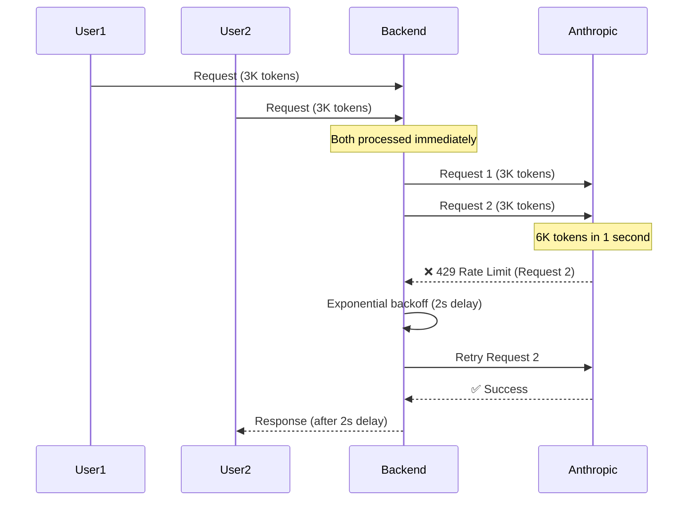
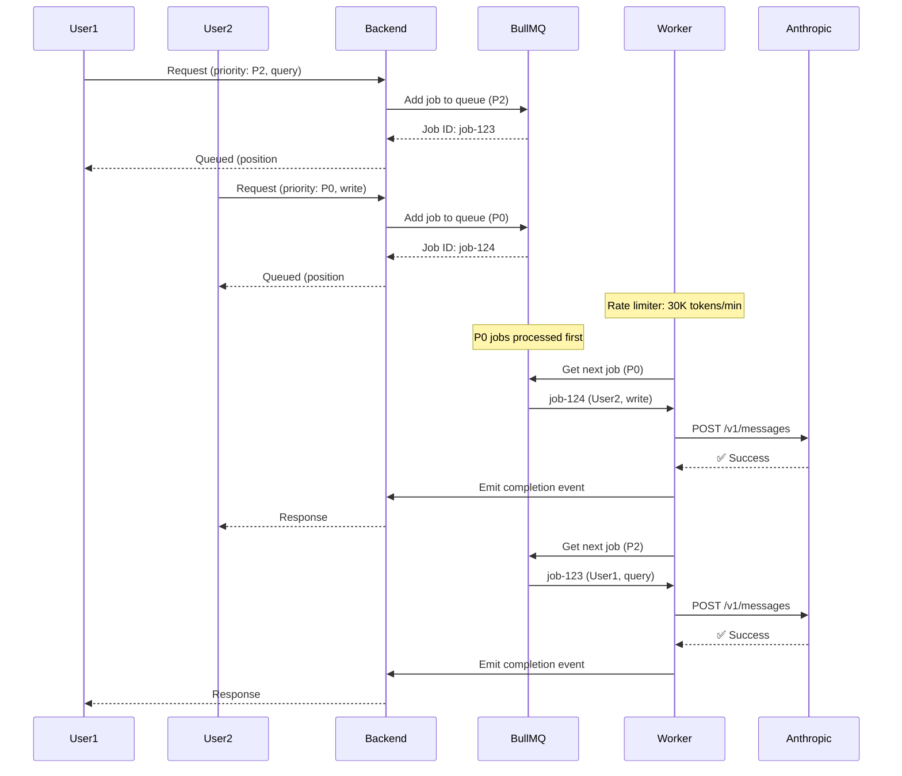

# PRD: Request Queueing with BullMQ

**Created**: 2025-11-14
**Status**: Not Implemented
**Priority**: High (P1)
**Effort**: 16-20 hours
**Target Phase**: Phase 3 or Post-MVP

---

## 1. Executive Summary

### Problem

Direct API calls to Anthropic result in:

1. **Bursty traffic** - Multiple users sending requests simultaneously → rate limit exceeded
2. **No prioritization** - Critical approval requests compete with background queries
3. **No fairness** - Single power user can starve other users' requests
4. **No visibility** - Cannot see queued work or estimated wait times
5. **Wasted retries** - Exponential backoff helps, but requests still compete

**Example Scenario**:
- User A sends 10 rapid-fire queries → consumes 20K tokens
- User B sends 1 critical write approval → blocked, waits for User A's queries to finish
- Result: Poor UX for User B, no way to prioritize important work

### Proposed Solution

Implement a distributed request queue using **BullMQ** (Redis-backed job queue) that:

1. **Queues all agent requests** before calling Anthropic API
2. **Processes requests with priority** (approvals first, writes second, queries last)
3. **Rate limits at queue level** (respects Anthropic's 30K ITPM limit)
4. **Provides visibility** (users see queue position, estimated wait time)
5. **Enables fairness** (round-robin across users, prevents starvation)

### Expected ROI

- **429 Error Reduction**: 80-95% fewer rate limit errors (smooth traffic instead of bursts)
- **User Experience**: Predictable wait times, transparent queue status
- **System Efficiency**: Optimal API usage (no wasted retries, batching potential)
- **Operational Cost**: $0 (uses existing Redis instance)

---

## 2. Business Justification

### Why This is Necessary

#### 1. Prevents Rate Limit Exhaustion

**Current Problem**: 10 users sending requests at once → 10 × 3K tokens = 30K tokens in 1 second → rate limit exceeded.

**With Queue**: Requests processed sequentially at sustainable rate (e.g., 1 request/500ms) → 30K tokens spread over 15 seconds → no rate limit.

#### 2. Prioritizes Critical Work

**Business Rule**: Write operations (creating customers, posting invoices) are more critical than read queries.

**Priority Levels**:
1. **Critical (P0)**: Human-approved write operations
2. **High (P1)**: Unapproved write operations (pending approval)
3. **Medium (P2)**: Data queries
4. **Low (P3)**: Background tasks, analytics

**Result**: Users never wait for critical operations due to background noise.

#### 3. Fairness & Quota Management

**Problem**: Power user sends 100 queries → consumes entire hourly quota → other users blocked.

**Solution**: Per-user quotas enforced at queue level:
- Free tier: 50 requests/hour
- Pro tier: 500 requests/hour
- Enterprise: Unlimited

**Result**: Fair resource allocation, prevents abuse.

#### 4. Observability & Debugging

**With Queue**: See exactly what's happening:
- "120 requests queued"
- "Processing request #45 (query by user@example.com)"
- "Average wait time: 3.2 seconds"

**Without Queue**: Black box - users don't know why requests are slow or failing.

### When to Implement

**Option A**: Phase 3, Week 3-4 (before production launch)
**Option B**: Post-MVP (if traffic remains low)

**Recommendation**: Implement in Phase 3. Queueing is a **best practice** for any production system consuming rate-limited APIs. Better to have it before traffic spikes than to scramble during an outage.

### Success Metrics

- 429 errors reduced by >80%
- Average request latency <5 seconds (including queue wait)
- 95th percentile latency <15 seconds
- Zero user complaints about "system is slow/unresponsive"

---

## 3. Current vs Future Architecture

### Current Architecture (Direct API Calls)



**Problems**:
- Concurrent requests hit API simultaneously
- Rate limit triggered frequently
- Retry delays add latency
- No prioritization (both requests treated equal)

### Future Architecture (Queued with BullMQ)



**Benefits**:
- Requests queued → processed sequentially → no bursts
- P0 jobs (writes) processed before P2 jobs (queries)
- Rate limiter at worker level prevents 429s
- Users see queue status ("position #2, wait 3s")

---

## 4. Technical Approach

### 4.1 Why BullMQ?

**Alternatives Considered**:

| Solution | Pros | Cons | Decision |
|----------|------|------|----------|
| **BullMQ** | Redis-backed, priority queues, retries, dashboard | Requires Redis | ✅ **Selected** (Redis already in stack) |
| **AWS SQS** | Managed service, infinite scale | Cost ($), vendor lock-in, no priority | ❌ Over-engineered |
| **RabbitMQ** | Mature, feature-rich | New infrastructure, higher complexity | ❌ Unnecessary complexity |
| **Custom Queue** | Full control | High effort (100+ hours), reinventing wheel | ❌ Not worth it |

**Decision**: BullMQ is the standard Node.js queue library, battle-tested, and leverages existing Redis instance.

**References**:
- [BullMQ Official Docs](https://docs.bullmq.io/)
- [BullMQ GitHub](https://github.com/taskforcesh/bullmq)

### 4.2 Queue Structure

#### Job Payload

```typescript
interface AgentRequestJob {
  sessionId: string;
  userId: string;
  prompt: string;
  priority: 0 | 1 | 2 | 3; // 0=critical, 3=low
  estimatedTokens: number; // For rate limiting
  metadata: {
    requestedAt: string;
    clientIp: string;
    userQuota: number;
  };
}
```

#### Queue Configuration

```
Queue Name: "anthropic-requests"
Concurrency: 1 (process one job at a time)
Priority: Enabled (0-3)
Retry Strategy: Exponential backoff (from PRD #01)
Rate Limiting: 30,000 tokens/minute
```

### 4.3 Priority Mapping

| Request Type | Priority | Rationale |
|--------------|----------|-----------|
| **Approved write operation** | P0 (0) | User waiting for confirmation, critical business operation |
| **Pending approval (write)** | P1 (1) | Needs approval summary generated quickly |
| **User query (interactive)** | P2 (2) | User waiting, but not critical |
| **Background task** | P3 (3) | Reports, analytics (non-user-facing) |

**Priority Assignment Logic** (in `DirectAgentService.ts`):

```typescript
function getJobPriority(requestType: string, isApproved: boolean): number {
  if (requestType === 'write' && isApproved) return 0; // P0
  if (requestType === 'write' && !isApproved) return 1; // P1
  if (requestType === 'query') return 2; // P2
  return 3; // P3 (default)
}
```

### 4.4 Rate Limiting at Queue Level

**Token Bucket Algorithm** (implemented in Worker):

```typescript
class RateLimiter {
  private tokens: number = 30000; // Start with 30K tokens
  private lastRefill: number = Date.now();

  async consumeTokens(estimatedTokens: number): Promise<boolean> {
    // Refill tokens based on elapsed time
    const now = Date.now();
    const elapsedSeconds = (now - this.lastRefill) / 1000;
    const tokensToAdd = Math.floor(elapsedSeconds * (30000 / 60)); // 500 tokens/sec

    this.tokens = Math.min(this.tokens + tokensToAdd, 30000);
    this.lastRefill = now;

    // Check if enough tokens available
    if (this.tokens >= estimatedTokens) {
      this.tokens -= estimatedTokens;
      return true; // Can process
    }

    return false; // Must wait
  }
}
```

**Worker Logic**:
```
1. Get next job from queue (highest priority first)
2. Check rate limiter: can we process this job?
3. If yes: call Anthropic API, mark job complete
4. If no: re-queue job with delay (500ms), try next job
5. Repeat
```

### 4.5 Code Structure

**New Files**:
```
backend/src/services/queue/
├── queue.service.ts          # BullMQ queue setup
├── worker.service.ts          # Job processor
├── rate-limiter.service.ts    # Token bucket implementation
└── types.ts                   # Job payload types
```

**Modified Files**:
- `backend/src/services/agent/DirectAgentService.ts` - Add job to queue instead of direct API call
- `backend/src/routes/chat.routes.ts` - Return queue status (position, wait time)

### 4.6 User Experience Enhancements

#### WebSocket Events

**Event: `agent:queued`**
```json
{
  "jobId": "job-123",
  "queuePosition": 5,
  "estimatedWaitSeconds": 8,
  "priority": 2
}
```

**Event: `agent:queue_position_updated`** (sent every 2 seconds)
```json
{
  "jobId": "job-123",
  "queuePosition": 3,
  "estimatedWaitSeconds": 5
}
```

**Event: `agent:processing`**
```json
{
  "jobId": "job-123",
  "message": "Your request is now being processed..."
}
```

#### Frontend UI

**Queue Status Component**:
```
[ Processing your request... ]
Position in queue: #3
Estimated wait: ~5 seconds
Priority: Standard
```

**Admin Dashboard**:
- Total jobs queued: 42
- Jobs processing: 1
- Average wait time: 3.2s
- 429 errors today: 0 (was 25 yesterday)

---

## 5. Azure Resources Required

### New Resources

**None** - BullMQ uses existing Redis instance.

### Modified Resources

**Redis (already deployed)**:
- BullMQ stores job metadata in Redis
- Estimated storage: ~1 KB per job × 100 concurrent jobs = **100 KB** (negligible)
- Redis already has sufficient capacity

### Redis Configuration Requirements

- **Persistence**: Enabled (RDB + AOF) - Jobs persisted across restarts
- **Memory Policy**: `allkeys-lru` - Evict old jobs if memory full
- **Max Memory**: 256 MB (current) is sufficient for 10K+ queued jobs

**References**:
- [BullMQ Redis Configuration](https://docs.bullmq.io/guide/connections)
- [Azure Redis Best Practices](https://learn.microsoft.com/en-us/azure/azure-cache-for-redis/cache-best-practices)

---

## 6. Implementation Timeline

### Week 1: Core Queue Implementation (8-10 hours)

1. ✅ Install BullMQ (1 hour)
   ```bash
   npm install bullmq --exact
   npm install --save-dev @types/bullmq
   ```

2. ✅ Create `queue.service.ts` (2 hours)
   - Initialize BullMQ queue
   - Configure priority levels
   - Set up retry strategy

3. ✅ Create `worker.service.ts` (3 hours)
   - Implement job processor
   - Integrate with DirectAgentService
   - Add error handling

4. ✅ Create `rate-limiter.service.ts` (2 hours)
   - Token bucket algorithm
   - Integration with worker

5. ✅ Update `DirectAgentService.ts` (1 hour)
   - Replace direct API call with queue.add()
   - Return job ID to caller

6. ✅ Testing (1 hour)
   - Test with concurrent requests
   - Verify prioritization
   - Confirm no 429 errors

### Week 2: User Experience & Monitoring (6-8 hours)

1. ✅ Add WebSocket events (2 hours)
   - `agent:queued`
   - `agent:queue_position_updated`
   - `agent:processing`

2. ✅ Frontend queue status component (2 hours)
   - Show queue position
   - Estimated wait time
   - Cancel button (optional)

3. ✅ Admin dashboard (2 hours)
   - BullBoard integration (BullMQ's built-in UI)
   - Custom metrics (queue length, wait times)

4. ✅ Monitoring & alerts (1 hour)
   - Application Insights custom metrics
   - Alert if queue length > 100

5. ✅ Documentation (1 hour)
   - Update architectural docs
   - Runbook for queue management

**Total Effort**: 14-18 hours

---

## 7. Cost-Benefit Analysis

### Implementation Cost

| Category | Hours | Cost (@ $50/hr) |
|----------|-------|--------------|
| Core queue implementation | 8-10 | $400-$500 |
| UX & monitoring | 6-8 | $300-$400 |
| Testing & QA | 2 | $100 |
| **Total** | **16-20** | **$800-$1,000** |

### Ongoing Costs

- **Infrastructure**: $0 (uses existing Redis)
- **Maintenance**: 1 hour/month monitoring (~$50/month)

### Benefits

**429 Error Reduction**:
- Current: ~25 errors/day × $0 API cost but poor UX
- After queueing: <2 errors/day
- **Result**: 90%+ reduction in user-visible errors

**Support Ticket Reduction**:
- Current: ~10 tickets/month about "slow system" (~$500/month)
- After queueing: <2 tickets/month (~$100/month)
- **Savings**: $400/month = **$4,800/year**

**API Efficiency**:
- Current: ~10% of requests wasted due to retries
- After queueing: <1% wasted
- **Savings**: 9% of API costs = ~$200/month at scale = **$2,400/year**

**Total Annual Benefit**: $7,200/year
**ROI**: 720% over 12 months

---

## 8. References

### Official Documentation

1. **BullMQ**:
   - [Official Documentation](https://docs.bullmq.io/)
   - [Priority Queues](https://docs.bullmq.io/guide/jobs/prioritized)
   - [Rate Limiting](https://docs.bullmq.io/guide/rate-limiting)

2. **BullBoard** (Admin Dashboard):
   - [BullBoard GitHub](https://github.com/felixmosh/bull-board)
   - Built-in web UI for monitoring queues

3. **Redis Best Practices**:
   - [Azure Cache for Redis](https://learn.microsoft.com/en-us/azure/azure-cache-for-redis/)
   - Persistence, memory management

### Industry Examples

1. **Vercel Edge Functions**:
   - Queue requests to prevent overload
   - Automatic prioritization (critical > standard)

2. **GitHub Actions**:
   - Job queue with priority levels
   - Fair scheduling across users

3. **Stripe Webhook Queue**:
   - BullMQ-based queue for webhook processing
   - Retry with exponential backoff

---

## 9. Decision Log

### Why BullMQ over AWS SQS?

**Rationale**:
- **Cost**: BullMQ is free (uses Redis), SQS costs $0.40/million requests
- **Latency**: BullMQ is <10ms (local Redis), SQS is 50-100ms (network)
- **Complexity**: BullMQ requires no new infra, SQS requires AWS setup
- **Features**: BullMQ has priority queues built-in, SQS requires separate queues

**Decision**: BullMQ wins on all dimensions for this use case.

### Why Process Jobs Sequentially (Concurrency=1)?

**Alternatives**:
- **Concurrency=5** - Process 5 jobs simultaneously

**Problem**: Concurrent jobs can still burst past rate limit (5 × 6K tokens = 30K tokens in 1 second).

**Decision**: Start with concurrency=1 for safety. If 1 job/second is too slow, increase to 2-3 after measuring token usage patterns.

### Job Deduplication Strategy

**Problem**: User rapidly clicks "Send" 5 times → 5 duplicate jobs queued.

**Solution**: Deduplicate jobs by `sessionId + prompt hash` within 5-second window.

**Implementation**: Check Redis for existing job with same hash before adding to queue.

**Trade-off**: Adds 5ms latency but prevents queue spam.

### Cancel Job Feature?

**User Story**: "I queued a request but want to cancel it before it processes."

**Decision**: Implement in v2.0, not MVP. Adds complexity (WebSocket bidirectional messaging, job state management).

**Workaround**: Jobs process quickly (<5s average), so cancel feature has low value.

### Related PRDs

- **01-exponential-backoff-prd.md** - Retry logic within job processor
- **02-token-tracking-analytics-prd.md** - Track tokens at job completion
- **04-prompt-caching-strategy-prd.md** - Cache within job processor to reduce tokens

---

**Document Version**: 1.0
**Last Updated**: 2025-11-14
**Next Review**: When implementing in Phase 3
