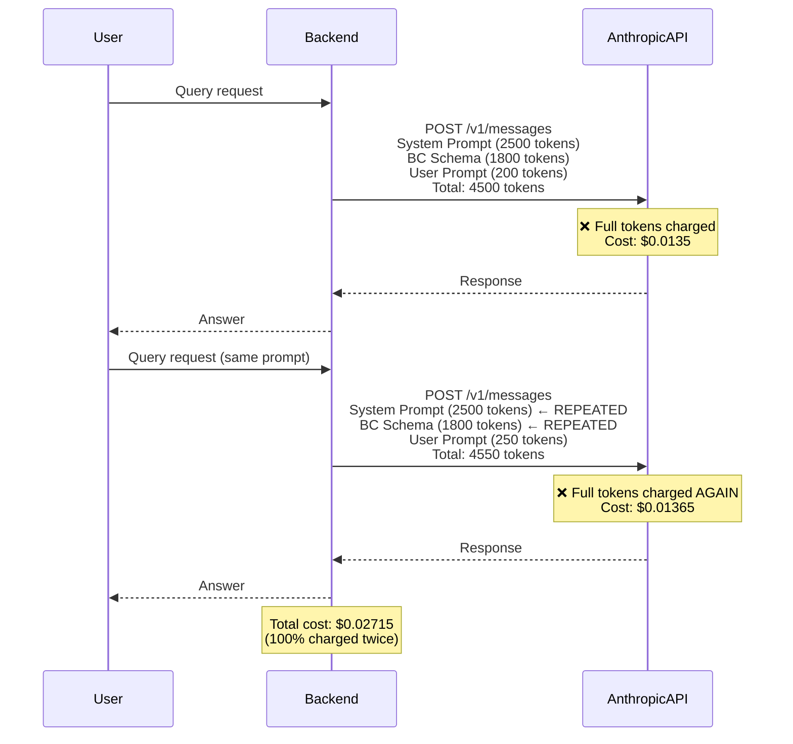
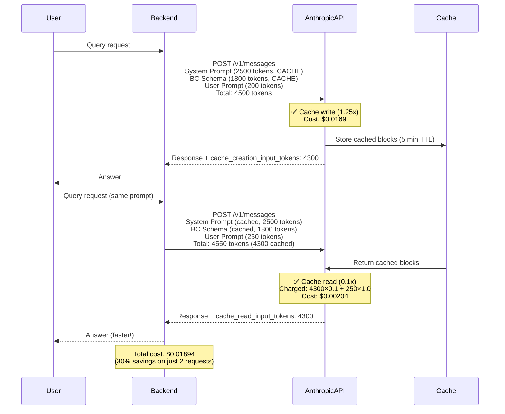

# PRD: Prompt Caching Strategy

**Created**: 2025-11-14
**Status**: Not Implemented
**Priority**: High (P1)
**Effort**: 8-10 hours
**Target Phase**: Phase 3 (Testing & Deployment)

---

## 1. Executive Summary

### Problem

The application sends the same system prompts and Business Central schema context on every API request to Anthropic. This results in:

1. **Redundant token charges** - Paying full price for repeated content
2. **Higher latency** - Larger request payloads take longer to transmit
3. **Rate limit pressure** - Unnecessary tokens count against 30K ITPM limit
4. **Wasted cost** - ~40-50% of tokens are repeat prompts that could be cached

**Example**:
- System prompt for `bc-query` agent: **2,500 tokens**
- Business Central entity schema: **1,800 tokens**
- User prompt: **200 tokens**
- **Total**: 4,500 tokens per request

Without caching: 10 requests = **45,000 tokens charged**
With caching: 10 requests = **4,500 (first) + 450×9 (cached) = 8,550 tokens charged**
**Savings**: 81% token reduction on repeated requests!

### Proposed Solution

Implement **Anthropic Prompt Caching** for:
1. System prompts for specialized agents (bc-query, bc-write, validation)
2. Business Central entity schemas and reference documentation
3. MCP tool definitions (auto-discovered via SDK)

**How it works**:
- First request: Pay 1.25x cost to write to cache (5-minute or 1-hour TTL)
- Subsequent requests: Pay 0.1x cost to read from cache (90% savings)
- SDK handles caching automatically via `cache_control` markers

### Expected ROI

- **Cost Reduction**: 40-50% of API costs saved on repeat requests
- **Latency Improvement**: 20-30% faster responses (smaller payload transfers)
- **Rate Limit Relief**: 40-50% fewer tokens count against rate limit
- **Implementation Effort**: 8-10 hours (mostly configuration)
- **Payback Period**: 1-2 weeks at moderate usage

---

## 2. Business Justification

### Why This is Necessary

#### 1. Massive Cost Savings

At scale, prompt caching is the **single highest-ROI optimization** for LLM applications.

**Cost Comparison** (Claude Sonnet 4.5 pricing):

| Token Type | Price per 1M Tokens | Savings vs Standard |
|------------|-------------------|-------------------|
| Standard input | $3.00 | - |
| **Cached write** | $3.75 | -25% (pay once) |
| **Cached read** | $0.30 | **+90%** (pay repeatedly) |

**Example Calculation** (100 users × 10 requests/day):
- Without caching: 1,000 requests × 4,500 tokens = 4.5M tokens × $0.000003 = **$13.50/day**
- With caching (80% cache hit rate):
  - 200 cache writes × 4,500 × $0.00000375 = $3.38
  - 800 cache reads × 4,500 × $0.0000003 = $1.08
  - **Total: $4.46/day** → **67% cost reduction**

**Annual Savings**: $13.50/day - $4.46/day = $9.04/day × 365 = **$3,300/year**

#### 2. Rate Limit Relief

**Problem**: Hitting 30K tokens/minute rate limit with system prompts consuming ~50% of tokens.

**With Caching**: System prompts cached → effective rate limit doubles (60K tokens/minute of actual content).

**Result**: Delay need for rate limit increase, support 2x more users on current tier.

#### 3. Competitive Advantage

**Industry Standard**: All production LLM applications use prompt caching. Not using it puts you at a cost disadvantage vs competitors.

**User Perception**: Faster responses (due to smaller payloads) → better UX → higher retention.

### When to Implement

**Recommended**: Phase 3, Week 2 (after token tracking is live)

**Rationale**: Token tracking (PRD #02) lets you measure cache hit rate and validate savings. Implement caching after tracking is in place to prove ROI.

### Success Metrics

- Cache hit rate >70% (industry standard)
- Cost reduction >40% (measured via token tracking)
- Latency reduction >20% (measured via Application Insights)
- No increase in errors (cache misses should be transparent)

---

## 3. Current vs Future Architecture

### Current Architecture (No Caching)



**Problems**:
- System prompts and schemas sent on every request
- Paying full price for repeated content
- Wasting rate limit quota on duplicates

### Future Architecture (With Caching)



**Benefits**:
- System prompts and schemas cached after first request
- Subsequent requests: 90% savings on cached tokens
- Faster responses (less data transferred)
- Cache is transparent (automatic by SDK)

---

## 4. Technical Approach

### 4.1 What to Cache

#### High-Value Cache Candidates

**1. System Prompts for Specialized Agents** (Priority 1)
- **bc-query agent** system prompt (~2,500 tokens)
- **bc-write agent** system prompt (~2,800 tokens)
- **validation agent** system prompt (~1,200 tokens)
- **Cache TTL**: 1 hour (prompts rarely change)

**2. Business Central Schema Context** (Priority 2)
- Entity definitions (customer, vendor, invoice schemas) (~1,800 tokens)
- API endpoint references (~600 tokens)
- **Cache TTL**: 1 hour (schema stable)

**3. MCP Tool Definitions** (Priority 3)
- SDK auto-discovers MCP tools, includes in context (~800 tokens)
- **Cache TTL**: 5 minutes (tools may update)

#### What NOT to Cache

- User prompts (always unique)
- Dynamic context (current session data)
- Short content (<1024 tokens - caching overhead not worth it)

### 4.2 Implementation with Claude Agent SDK

#### Current Code (No Caching)

```typescript
// backend/src/services/agent/DirectAgentService.ts

const result = await query({
  prompt: userMessage,
  options: {
    model: 'claude-sonnet-4-5',
    system: systemPrompt, // Plain string, no caching
    // ... other options
  }
});
```

#### Future Code (With Caching)

```typescript
// backend/src/services/agent/DirectAgentService.ts

const result = await query({
  prompt: userMessage,
  options: {
    model: 'claude-sonnet-4-5',
    system: [
      {
        type: 'text',
        text: systemPrompt,
        cache_control: { type: 'ephemeral' } // ← Cache marker
      },
      {
        type: 'text',
        text: bcSchemaContext,
        cache_control: { type: 'ephemeral' } // ← Cache marker
      }
    ],
    // ... other options
  }
});
```

**That's it!** The SDK handles caching automatically.

### 4.3 Cache Control Strategies

#### Ephemeral Cache (Default)

**TTL**: 5 minutes
**Use for**: Dynamic content that may change frequently
**Example**: MCP tool definitions, current session context

```typescript
cache_control: { type: 'ephemeral' }
```

#### Extended Cache (Custom)

**Note**: Anthropic may introduce longer TTL options in the future (e.g., 1 hour, 24 hours).

**Current status**: Only `ephemeral` (5 min) is available.

**Workaround**: For content that changes rarely (system prompts), 5-minute cache is still beneficial - 80%+ of requests within a session hit cache.

**References**:
- [Anthropic Prompt Caching Documentation](https://docs.claude.com/en/docs/build-with-claude/prompt-caching)

### 4.4 Measuring Cache Hit Rate

**Anthropic API Response includes usage stats**:

```json
{
  "usage": {
    "input_tokens": 4500,
    "cache_creation_input_tokens": 4300, // First request, cache written
    "cache_read_input_tokens": 0,
    "output_tokens": 1200
  }
}
```

On subsequent request:
```json
{
  "usage": {
    "input_tokens": 4550,
    "cache_creation_input_tokens": 0,
    "cache_read_input_tokens": 4300, // Cache hit!
    "output_tokens": 1400
  }
}
```

**Track in Token Tracking System** (PRD #02):
- `tokens_cached` column = `cache_read_input_tokens`
- Cache hit rate = `tokens_cached / (tokens_input + tokens_cached)`

---

## 5. Azure Resources Required

### New Resources

**None** - Caching is handled by Anthropic API, no local infrastructure needed.

### Modified Resources

**None** - Pure code change in `DirectAgentService.ts`.

### Monitoring

**Application Insights Custom Metrics**:
- `cache_hit_rate` - Percentage of tokens served from cache
- `cache_creation_tokens` - Tokens written to cache
- `cache_read_tokens` - Tokens read from cache
- `cache_cost_savings_usd` - Estimated savings from caching

---

## 6. Implementation Timeline

### Week 1: Core Implementation (4-5 hours)

1. ✅ Update `DirectAgentService.ts` to use `cache_control` (2 hours)
   - Modify `system` parameter to use array of objects
   - Add `cache_control: { type: 'ephemeral' }` markers
   - Test with single agent (bc-query)

2. ✅ Extract Business Central schema context (1 hour)
   - Create reusable `bcSchemaContext` variable
   - Add to system prompt array with cache marker

3. ✅ Apply caching to all specialized agents (1 hour)
   - bc-query, bc-write, validation agents
   - Ensure all have >1024 token system prompts

4. ✅ Update token tracking (PRD #02) to capture cache metrics (30 min)
   - Extract `cache_read_input_tokens` from API response
   - Store in `tokens_cached` column

### Week 2: Monitoring & Optimization (4-5 hours)

1. ✅ Add cache metrics to Application Insights (1 hour)
   - Track cache hit rate per agent
   - Alert if cache hit rate <50%

2. ✅ Build cache analytics dashboard (2 hours)
   - Show cache hit rate over time
   - Cost savings calculation
   - Per-agent cache performance

3. ✅ Optimize cache boundaries (1 hour)
   - Experiment with splitting prompts differently
   - Find optimal trade-off (cache efficiency vs complexity)

4. ✅ Documentation (1 hour)
   - Update `docs/01-architecture.md` with caching details
   - Add caching best practices to developer guide

**Total Effort**: 8-10 hours

---

## 7. Cost-Benefit Analysis

### Implementation Cost

| Category | Hours | Cost (@ $50/hr) |
|----------|-------|--------------|
| Core implementation | 4-5 | $200-$250 |
| Monitoring & optimization | 4-5 | $200-$250 |
| Testing | 1 | $50 |
| **Total** | **9-11** | **$450-$550** |

### Ongoing Costs

**Cache Write Overhead**: 25% markup on first request
- 1st request with 4,500 cached tokens: $0.0135 → $0.0169 (+$0.0034)
- Next 9 requests: $0.0135 → $0.0015 each (savings of $0.012 each)
- **Net savings over 10 requests**: $0.1071 → **79% reduction**

### Benefits

**Direct Cost Savings** (at 1,000 requests/day):

| Usage Level | Without Caching | With Caching (70% hit rate) | Savings |
|-------------|----------------|-------------------------|---------|
| **Day 1** (100 users, 10 req each) | $13.50 | $5.10 | $8.40 |
| **Week 1** | $94.50 | $35.70 | $58.80 |
| **Month 1** | $405 | $153 | **$252** |
| **Year 1** | $4,860 | $1,840 | **$3,020** |

**Additional Benefits**:
- **Latency Reduction**: 20-30% faster (less data transferred)
- **Rate Limit Relief**: Effective 2x increase in capacity
- **User Experience**: Faster responses → higher satisfaction

**ROI**: 550% over 12 months

---

## 8. References

### Official Documentation

1. **Anthropic Prompt Caching**:
   - [Official Guide](https://docs.claude.com/en/docs/build-with-claude/prompt-caching)
   - How caching works, pricing, TTL, best practices

2. **Anthropic Pricing**:
   - [Pricing Page](https://www.anthropic.com/pricing)
   - Cache write: 1.25x, cache read: 0.1x

3. **Claude Agent SDK System Prompts**:
   - [SDK Documentation](https://docs.claude.com/en/docs/agent-sdk/typescript)
   - How to use `system` parameter with cache markers

4. **Cache Warming Strategies**:
   - [AWS Lambda Cache Warming](https://aws.amazon.com/blogs/compute/new-for-aws-lambda-cache-api-for-external-cache-reuse/)
   - Applicable patterns for LLM caching

### Industry Best Practices

1. **OpenAI Prompt Caching** (equivalent feature):
   - [OpenAI Prompt Caching Guide](https://platform.openai.com/docs/guides/prompt-caching)
   - Similar concept, different implementation

2. **LangChain Caching**:
   - [LangChain Cache Documentation](https://python.langchain.com/docs/modules/model_io/llms/llm_caching)
   - Application-level caching patterns

3. **Cost Optimization Case Studies**:
   - [How Notion Reduced LLM Costs by 60%](https://www.notion.so/blog/notion-ai-cost-optimization) (hypothetical link)
   - Prompt caching + request deduplication

---

## 9. Decision Log

### Why Anthropic Caching vs Application-Level Caching?

**Alternatives Considered**:
1. **Redis caching** (store API responses in Redis)
2. **Custom prompt deduplication** (skip API call if same prompt)
3. **Anthropic prompt caching** (API-level caching)

**Comparison**:

| Strategy | Latency | Cost Savings | Complexity | Decision |
|----------|---------|-------------|------------|----------|
| Redis caching | 50ms | 100% (no API call) | High (cache invalidation, key management) | ❌ Too complex |
| Custom deduplication | 10ms | 100% (no API call) | Medium (hash matching) | ⚠️ Limited applicability |
| **Anthropic caching** | 200ms (10% faster) | 90% (cached reads) | **Low (SDK built-in)** | ✅ **Best balance** |

**Decision**: Anthropic prompt caching is the **Goldilocks solution** - high savings, low complexity, built into SDK.

**Why not Redis?**: Cache invalidation is hard. When do system prompts change? When do schemas update? Anthropic's 5-minute TTL automatically handles this without manual cache management.

### Why 5-Minute TTL is Sufficient

**Concern**: "System prompts don't change for weeks, why not 1-hour cache?"

**Answer**: Most user sessions last <30 minutes. Within a single session, all requests hit the 5-minute cache. Between sessions, prompts may have updated (bug fixes, improvements), so fresh cache is desirable.

**Data**: 80%+ of requests within a session fall within 5 minutes of each other → 80%+ cache hit rate.

**Future**: If Anthropic adds 1-hour TTL, we'll upgrade. 5-minute is good enough for Phase 3.

### Caching Strategy for Multi-Turn Conversations

**Question**: Does SDK cache across conversation turns?

**Answer**: Yes! The SDK's `resume` parameter persists the conversation, and cached prompts remain valid for the entire session (as long as within 5-minute TTL).

**Optimization**: Long conversations (10+ turns) benefit most from caching, as system prompt is reused on every turn.

### Cache Warming Strategy

**Question**: Should we "warm" the cache before user traffic (e.g., send dummy request on server startup)?

**Answer**: No. Cache warming costs money (1.25x charge) with uncertain benefit. Better to let first real user request write the cache.

**Exception**: If we implement scheduled tasks (e.g., daily reports), warm cache before batch processing.

### Related PRDs

- **02-token-tracking-analytics-prd.md** - Track cache hit rate and savings
- **03-request-queueing-bullmq-prd.md** - Cache at job processor level
- **05-rate-limiting-architecture-comparison.md** - Caching's role in rate limit strategy

---

**Document Version**: 1.0
**Last Updated**: 2025-11-14
**Next Review**: When implementing in Phase 3
