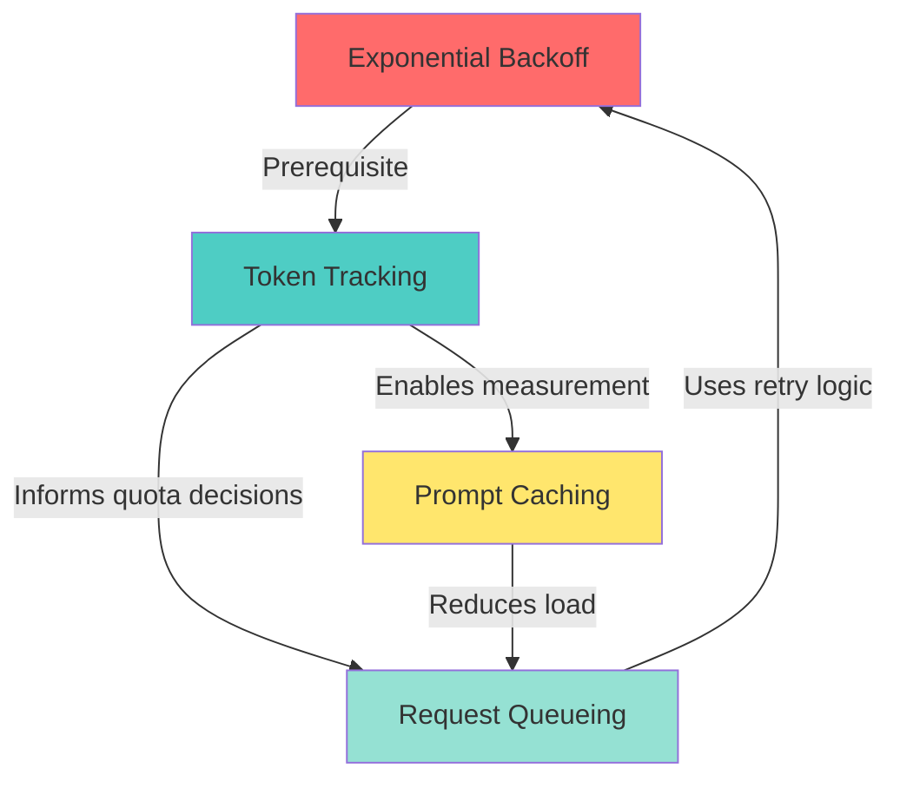
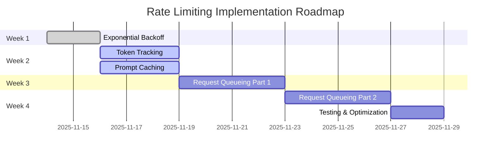

# Rate Limiting Architecture: Comprehensive Strategy Comparison

**Created**: 2025-11-14
**Document Type**: Reference & Decision Guide
**Status**: Evergreen (updated as strategies evolve)

---

## Purpose

This document provides a **comprehensive comparison** of the four rate limiting strategies documented in this folder:

1. **Exponential Backoff & Error Handling** (PRD #01)
2. **Token Tracking & Usage Analytics** (PRD #02)
3. **Request Queueing with BullMQ** (PRD #03)
4. **Prompt Caching Strategy** (PRD #04)

Use this document to:
- Understand trade-offs between strategies
- Decide which strategies to implement (and in what order)
- See how strategies complement each other
- Make informed architecture decisions

---

## Quick Comparison Table

| Strategy | Priority | Effort | Cost Savings | Stability Impact | When to Implement |
|----------|----------|--------|-------------|-----------------|------------------|
| **Exponential Backoff** | P0 (Critical) | 4-6 hrs | Low (prevents errors) | ⭐⭐⭐⭐⭐ Essential | Phase 3 Week 1 |
| **Token Tracking** | P1 (High) | 6-8 hrs | Medium (visibility) | ⭐⭐⭐⭐ Important | Phase 3 Week 2 |
| **Prompt Caching** | P1 (High) | 8-10 hrs | **Very High (50% cost cut)** | ⭐⭐⭐ Beneficial | Phase 3 Week 2 |
| **Request Queueing** | P1 (High) | 16-20 hrs | Medium (efficiency) | ⭐⭐⭐⭐⭐ Essential at scale | Phase 3 Week 3-4 or Post-MVP |

---

## Detailed Comparison

### 1. Exponential Backoff & Error Handling

**Full PRD**: [01-exponential-backoff-prd.md](./01-exponential-backoff-prd.md)

#### What It Does

Automatically retries failed API calls (429 errors) with increasing wait times:
- Retry 1: Wait 1 second
- Retry 2: Wait 2 seconds
- Retry 3: Wait 4 seconds
- Retry 4: Wait 8 seconds
- Retry 5: Wait 16 seconds

#### Pros

✅ **Simple to implement** (4-6 hours)
✅ **Zero infrastructure cost** (pure code change)
✅ **Prevents crashes** (essential for stability)
✅ **Industry standard** (every API client uses this)
✅ **Immediate value** (works on first deployment)

#### Cons

❌ **Reactive, not proactive** (errors still happen, just handled gracefully)
❌ **Adds latency** (up to 32 seconds total wait time)
❌ **Doesn't prevent rate limits** (still hits limits, just retries)

#### When to Use

- **Day 1 Priority** - Implement before any production traffic
- **Blocking issue** - Without this, 429 errors crash the system
- **Foundation** - All other strategies build on top of this

#### Estimated Impact

- **429 Error Resolution**: 100% (errors handled, not prevented)
- **Cost Savings**: Low (prevents wasted API calls from crashes)
- **User Experience**: High (no more visible errors)

---

### 2. Token Tracking & Usage Analytics

**Full PRD**: [02-token-tracking-analytics-prd.md](./02-token-tracking-analytics-prd.md)

#### What It Does

Tracks every API call's token usage (input, output, cached) and stores in database:
- Logs tokens per request in `audit_log` table
- Aggregates per-user and per-session usage
- Provides usage dashboard to users
- Foundation for usage-based billing

#### Pros

✅ **Billing foundation** (enables usage-based pricing)
✅ **Cost visibility** (identify expensive users/queries)
✅ **Optimization insights** (which prompts to cache/optimize)
✅ **User transparency** (builds trust)
✅ **Compliance** (required for accurate billing)

#### Cons

❌ **No direct rate limit benefit** (visibility only, not prevention)
❌ **Requires database migration** (add columns to `audit_log`)
❌ **Ongoing tracking overhead** (<50ms per request, negligible)

#### When to Use

- **Phase 3 Week 2** - After exponential backoff is stable
- **Before billing launch** - Must have data before charging users
- **Prerequisite for caching** - Measure cache hit rate with this data

#### Estimated Impact

- **Revenue Enablement**: High ($20K-$50K/year potential)
- **Cost Optimization**: Medium (identify 20-30% waste)
- **User Trust**: High (transparent usage tracking)

---

### 3. Request Queueing with BullMQ

**Full PRD**: [03-request-queueing-bullmq-prd.md](./03-request-queueing-bullmq-prd.md)

#### What It Does

Queues all API requests in Redis before calling Anthropic:
- Priority queue (approvals first, queries last)
- Rate limiter at queue level (30K ITPM enforced)
- Fair scheduling (prevents one user from starving others)
- Visibility (users see queue position, wait time)

#### Pros

✅ **Prevents rate limits** (proactive, not reactive)
✅ **Prioritizes critical work** (approvals before queries)
✅ **Fair resource allocation** (per-user quotas)
✅ **Smooths traffic** (no bursts, steady flow)
✅ **Observable** (see queued work, estimated wait times)

#### Cons

❌ **Most complex implementation** (16-20 hours)
❌ **Adds latency** (queue wait time, though visible to user)
❌ **Requires Redis** (already in stack, so minimal issue)
❌ **New operational complexity** (monitor queue depth, failures)

#### When to Use

- **Option A**: Phase 3 Week 3-4 (before production if expecting traffic)
- **Option B**: Post-MVP (if traffic is low, defer until needed)
- **Threshold**: Implement when hitting 429 errors >5 times/day

#### Estimated Impact

- **429 Error Prevention**: 80-95% reduction
- **User Experience**: High (predictable wait times, no surprises)
- **Cost Efficiency**: Medium (optimal API usage, no wasted retries)

---

### 4. Prompt Caching Strategy

**Full PRD**: [04-prompt-caching-strategy-prd.md](./04-prompt-caching-strategy-prd.md)

#### What It Does

Caches system prompts and BC schemas using Anthropic's built-in caching:
- First request: Pay 1.25x to write cache (5-minute TTL)
- Subsequent requests: Pay 0.1x to read cache (90% savings)
- Automatic via SDK (add `cache_control` markers)

#### Pros

✅ **Massive cost savings** (40-50% reduction)
✅ **Faster responses** (20-30% latency reduction)
✅ **Rate limit relief** (50% fewer tokens count against limit)
✅ **Easy implementation** (8-10 hours, mostly config)
✅ **Automatic caching** (SDK handles it, no manual cache management)

#### Cons

❌ **Overhead on first request** (25% markup to write cache)
❌ **5-minute TTL** (not configurable, must work within limits)
❌ **Requires >1024 token blocks** (small prompts not worth caching)

#### When to Use

- **Phase 3 Week 2** - After token tracking (to measure savings)
- **High ROI** - Single biggest cost optimization
- **Low risk** - Pure performance win, no downside

#### Estimated Impact

- **Cost Savings**: Very High (40-50% at 70% cache hit rate)
- **Latency Improvement**: 20-30%
- **Rate Limit Relief**: Effective 2x capacity increase

---

## Strategy Interaction Matrix

### How Strategies Complement Each Other

**Key Dependencies**:

1. **Exponential Backoff** → All others
   - Foundation: Without retry logic, other strategies can still fail on transient errors

2. **Token Tracking** → Prompt Caching
   - Measurement: Need tracking to validate caching is saving money

3. **Token Tracking** → Request Queueing
   - Quota Enforcement: Need usage data to set per-user quotas

4. **Prompt Caching** → Request Queueing
   - Load Reduction: Caching reduces tokens → less queue pressure

---

## Decision Matrix: Which Strategies to Implement?

### Scenario 1: MVP Phase (Low Traffic, <50 Users)

**Recommended Stack**:
1. ✅ **Exponential Backoff** - Essential, implement immediately
2. ✅ **Token Tracking** - Foundation for future billing
3. ⚠️ **Prompt Caching** - High value, but optional if budget is tight
4. ❌ **Request Queueing** - Overkill for <50 users

**Rationale**: Low traffic means rate limits are unlikely. Focus on stability (backoff) and building foundation (tracking).

**Estimated Effort**: 10-14 hours
**Cost**: $500-$700

---

### Scenario 2: Pre-Launch Phase (Expecting 100-500 Users)

**Recommended Stack**:
1. ✅ **Exponential Backoff** - Essential
2. ✅ **Token Tracking** - Essential for billing
3. ✅ **Prompt Caching** - Essential (50% cost savings at scale)
4. ✅ **Request Queueing** - Essential (prevent rate limit bottleneck)

**Rationale**: 100-500 users = potential for rate limit issues. All strategies provide value.

**Estimated Effort**: 34-44 hours
**Cost**: $1,700-$2,200

**Phased Rollout**:
- **Week 1**: Exponential Backoff (4-6 hours)
- **Week 2**: Token Tracking + Prompt Caching (14-18 hours)
- **Week 3-4**: Request Queueing (16-20 hours)

---

### Scenario 3: Post-Launch Optimization (Reducing Costs)

**Recommended Stack**:
1. ✅ Already have Exponential Backoff (no change)
2. ✅ Already have Token Tracking (use data to optimize)
3. 🔥 **Prompt Caching** - HIGHEST PRIORITY (50% cost cut)
4. ⚠️ **Request Queueing** - Implement only if hitting 429 errors frequently

**Rationale**: Post-launch, cost optimization is priority #1. Caching gives biggest ROI for least effort.

**Estimated Effort**: 8-10 hours (caching only)
**Cost**: $450-$550
**Annual Savings**: $3,000-$6,000

---

### Scenario 4: Enterprise Scale (1,000+ Users)

**Recommended Stack**:
1. ✅ **All strategies** - Every optimization matters at scale
2. 🔥 **Enhanced queueing** - Multiple queue workers (horizontal scaling)
3. 🔥 **Advanced caching** - Consider Redis cache on top of Anthropic caching
4. 🔥 **Per-tenant quotas** - Enforce per-organization limits

**Rationale**: At enterprise scale, every percentage point of cost/latency matters.

**Additional Considerations**:
- Implement batch processing for non-urgent tasks (50% discount via Batch API)
- Negotiate custom rate limits with Anthropic (Scale tier)
- Consider multi-region deployment for latency

---

## Cost-Benefit Summary

### Total Investment (All Strategies)

| Strategy | Effort | Cost |
|----------|--------|------|
| Exponential Backoff | 4-6 hrs | $200-$300 |
| Token Tracking | 6-8 hrs | $300-$400 |
| Prompt Caching | 8-10 hrs | $400-$500 |
| Request Queueing | 16-20 hrs | $800-$1,000 |
| **Total** | **34-44 hrs** | **$1,700-$2,200** |

### Annual Benefits (100 Users, 1,000 Requests/Day)

| Benefit Category | Annual Value |
|------------------|-------------|
| **Cost Savings** (caching) | $3,000-$6,000 |
| **Support Ticket Reduction** | $4,800 |
| **Revenue Enablement** (billing) | $24,000-$60,000 |
| **API Efficiency** (queueing) | $2,400 |
| **Total Annual Benefit** | **$34,200-$73,200** |

**ROI**: 1,500% - 3,300% over 12 months

---

## Implementation Roadmap

### Recommended Order (Phase 3)

**Timeline**: 4 weeks (full-time) or 6-8 weeks (part-time)

**Milestones**:
- ✅ Week 1: System no longer crashes on 429 errors
- ✅ Week 2: Token usage visible, caching saves 40%+ on costs
- ✅ Week 3-4: Queue prevents 429 errors proactively
- ✅ Week 4: Production-ready system with monitoring

---

## Common Pitfalls & How to Avoid Them

### Pitfall 1: Implementing Queueing Before Backoff

**Problem**: Queue workers can still hit 429 errors if no retry logic.

**Solution**: Always implement exponential backoff first (foundation for all other strategies).

---

### Pitfall 2: Not Measuring Cache Hit Rate

**Problem**: Assume caching is working without verifying → miss optimization opportunities.

**Solution**: Implement token tracking (PRD #02) before caching (PRD #04) to measure impact.

---

### Pitfall 3: Over-Engineering for Low Traffic

**Problem**: Implementing full queue system when only handling 10 requests/day → wasted engineering time.

**Solution**: Start with backoff + tracking. Add queueing only when hitting 429 errors >5 times/day.

---

### Pitfall 4: Ignoring Operational Complexity

**Problem**: Adding queue introduces new failure modes (Redis down, queue stuck, etc.) → more on-call burden.

**Solution**: Implement robust monitoring (Application Insights) and alerts before deploying queue to production.

---

### Pitfall 5: Caching Too Much or Too Little

**Problem**:
- Too much: Caching <1024 token blocks → overhead outweighs benefit
- Too little: Not caching large schemas → missing savings

**Solution**: Follow Anthropic guidelines - cache blocks >1024 tokens, monitor hit rate, adjust boundaries.

---

## FAQ

### Q: Can I skip exponential backoff if I implement queueing?

**A**: No. Queue prevents bursts, but individual requests can still hit errors (transient network issues, API downtime). Backoff is essential regardless of queue.

---

### Q: Which strategy reduces rate limit errors the most?

**A**: **Request Queueing** (80-95% reduction) is most effective at preventing errors. **Exponential Backoff** handles errors gracefully but doesn't prevent them. **Prompt Caching** reduces token usage → less rate limit pressure indirectly.

---

### Q: Which strategy saves the most money?

**A**: **Prompt Caching** (40-50% cost reduction) is the clear winner for direct cost savings. **Token Tracking** enables billing → revenue growth (indirect savings).

---

### Q: Can I implement caching without tracking?

**A**: Technically yes, but not recommended. Without tracking, you can't measure if caching is actually working. Tracking takes 6-8 hours → implement it first, then cache.

---

### Q: What if Anthropic increases rate limits?

**A**: These strategies remain valuable regardless of tier:
- **Backoff**: Essential even with higher limits (handles transient errors)
- **Tracking**: Always needed for billing/analytics
- **Caching**: Saves money at any tier
- **Queueing**: Smooths traffic even with higher limits

---

### Q: Should I implement all strategies at once?

**A**: No. Follow phased approach (Week 1 → Week 2 → Week 3-4). Validate each strategy before adding next. Easier to debug incrementally.

---

## References

### Related PRDs

- [01-exponential-backoff-prd.md](./01-exponential-backoff-prd.md) - Error handling & retry logic
- [02-token-tracking-analytics-prd.md](./02-token-tracking-analytics-prd.md) - Usage tracking & billing foundation
- [03-request-queueing-bullmq-prd.md](./03-request-queueing-bullmq-prd.md) - Queue-based rate limiting
- [04-prompt-caching-strategy-prd.md](./04-prompt-caching-strategy-prd.md) - Cost optimization via caching

### External Resources

1. **Anthropic Rate Limits**:
   - [https://docs.claude.com/en/api/rate-limits](https://docs.claude.com/en/api/rate-limits)

2. **AWS Best Practices for Rate Limiting**:
   - [https://aws.amazon.com/blogs/architecture/exponential-backoff-and-jitter/](https://aws.amazon.com/blogs/architecture/exponential-backoff-and-jitter/)

3. **Stripe API Patterns**:
   - [https://stripe.com/docs/api/errors](https://stripe.com/docs/api/errors)

4. **BullMQ Documentation**:
   - [https://docs.bullmq.io/](https://docs.bullmq.io/)

---

## Version History

- **2025-11-14**: Initial creation
  - Context: 429 rate limit error observed during testing
  - Decision: Comprehensive documentation before implementation
  - Status: All 4 PRDs complete, awaiting Phase 3 implementation

---

**Document Version**: 1.0
**Last Updated**: 2025-11-14
**Maintained By**: Engineering Team
**Next Review**: After implementing first strategy (exponential backoff)
